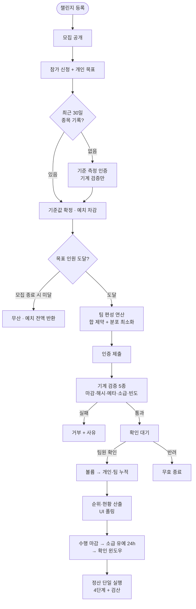
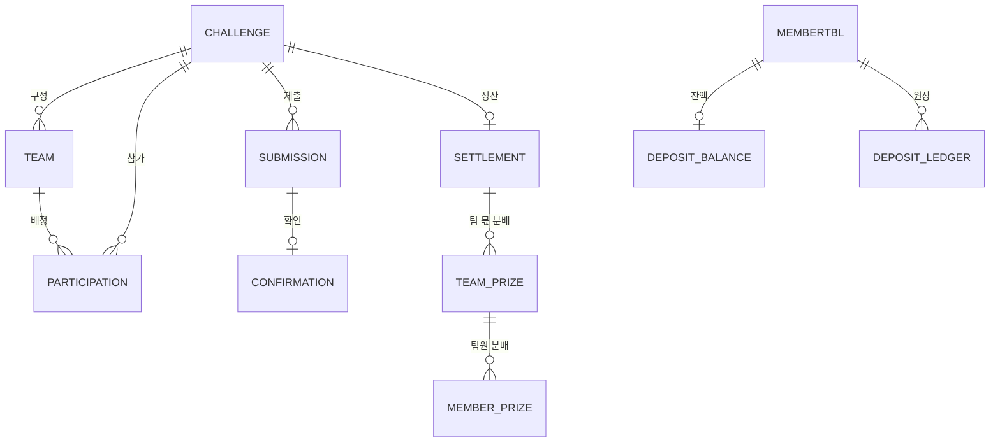

# 🏋️ 팀 대항 등수형 챌린지 서비스

> **디바이스 자동 측정 없이** 운동 수행을 검증하고, 개인 목표 달성과 팀 순위 경쟁의 **이중 보상을 정합성 있게 정산**하는 웨이트 트레이닝 챌린지 플랫폼


**개발**: 1인 풀사이클 (기획 → 요구사항 명세 → 설계 명세 → 구현 → 시나리오 테스트) · 2026.06 ~ 2026.07

---

## 목차

1. [문제의식과 해법](#1-문제의식과-해법)
2. [기술 스택](#2-기술-스택)
3. [핵심 설계 포인트](#3-핵심-설계-포인트)
4. [시스템 흐름](#4-시스템-흐름)
5. [주요 기능](#5-주요-기능)
6. [API 요약](#6-api-요약)
7. [데이터 모델](#7-데이터-모델)
8. [테스트](#8-테스트)
9. [실행 방법](#9-실행-방법)
10. [개발 프로세스와 문서](#10-개발-프로세스와-문서)

---

## 1. 문제의식과 해법

### 문제 ① — 수행을 믿을 근거가 없다

걸음 수·심박과 달리 **웨이트 트레이닝의 무게와 횟수는 디바이스가 재주지 않는다.** 기존 챌린지 서비스가 자동 측정 가능한 종목에 머무는 이유다.

**→ 검증을 두 계층으로 분리했다.** 기계가 판정할 수 있는 것과 사람만 판정할 수 있는 것이 다르기 때문이다.

| 판정 주체 | 검사 내용 | 차단하는 부정 |
|-----------|----------|--------------|
| **시스템 (기계)** | 사진 해시 중복 · EXIF 메타데이터 정합성 · 소급 등록 유예(24h) · 하루 상한/인증 주기 | 같은 사진 재사용, 날짜 조작, 도배 |
| **팀원 (사람)** | 인증샷이 실제 그 수행을 담았는지의 진위 | 허위 인증 |

점수를 움직이는 것은 제출이 아니라 **팀원의 확인**이다. 기계 검증은 사람이 판정하기 전에 위·변조를 걸러내는 게이트다.

### 문제 ② — 개인 보상과 팀 보상의 정합성

인증 한 건이 두 보상에 다르게 반영된다. 개인은 **목표 달성/미달 판정**(초과분 미인정 → 수치를 부풀릴 유인 제거), 팀은 **볼륨(무게×횟수) 누적 경쟁**. 그리고 **미달자의 예치금 차감분이 팀 상금풀의 재원**으로 들어가 두 보상이 금액으로 연결된다 — 이 연결이 어긋나면 정산이 끝나지 않는 구조로 설계했다.

---

## 2. 기술 스택

| 구분 | 기술 | 비고 |
|------|------|------|
| Language / Runtime | Java 17 | |
| Framework | Spring Boot 3.3.5, Spring Data JPA | `ddl-auto: none` — 스키마는 DDL 스크립트로만 관리 |
| 인증 | Spring Security + JWT (jjwt) | 무상태(STATELESS), HttpOnly 쿠키, BCrypt |
| DB | Oracle Database | 전용 계정·스키마 분리 운용 |
| 이미지 검증 | metadata-extractor | EXIF 촬영 시각 ↔ 수행 날짜 정합성 검사 |
| Frontend | HTML + CSS + Vanilla JS | 프레임워크·빌드 도구 없음, fetch 기반 API 호출, 순위 폴링 |
| 테스트 | Postman | 시나리오 컬렉션 55개 요청, 오류 케이스 포함 전 구간 통과 |

---

## 3. 핵심 설계 포인트

### 3.1 팀 편성 알고리즘 — "합은 제약, 분포는 목표"

목표 인원이 차는 순간 시스템이 전원을 자동 편성한다. 공정성의 두 축(팀 간 실력 **합** 균형, 팀 내 실력 **분포** 균형)은 서로 상충하고 단위도 달라(원단위 vs 제곱단위) 단일 점수로 합칠 수 없다.

- **합 편차**는 넘으면 안 되는 **제약**(허용폭 = 전체 팀 합 평균 × r%), **분포 편차**는 그 안에서 **최소화하는 목표**로 역할을 비대칭 분리
- 시작 배정 2개(교대 방향 배정, 내림차순 그리디)를 각각 **1:1 교환 반복**으로 개선 후 우수한 쪽 채택 — 국소 최적 탈출을 위한 다중 시작점
- **4가지 보장**: 정원 유지 · 편성 무실패 · 반드시 종료(교환마다 분포 편차 단조 감소) · 결정성(동률 규칙까지 정의 → 같은 입력이면 같은 출력)

구현: [`TeamFormationEngine`](src/main/java/com/exercisemanagement/challenge/service/TeamFormationEngine.java)

### 3.2 정산 — 재원 등식이 맞아야 끝난다

확인 윈도우 종료 시 **단 한 번** 실행되는 4단계 파이프라인. 앞 단계 출력이 뒤 단계 입력이다.

```
① 개인 판정 (달성→환급 / 미달→차감)
② 상금풀 확정 = 기본 상금풀 + ①의 차감분 총합
③ 팀 순위 분배 (등차 가중 · 내림 · 나머지 시스템 환수)
④ 팀 내 분배 (볼륨 기여도 비율 · 내림 · 나머지 환수)
```

- **원자성**: 4단계 전체 단일 트랜잭션 — 검산식(`팀 분배 합 + 환수 = 상금풀`, `환급 합 = 달성자 예치 합`) 불일치 시 전체 롤백
- **단일 실행**: SETTLEMENT 테이블의 챌린지당 1행 제약 + 원장 **멱등 키**로 재실행에도 이중 지급 차단
- **원장(Ledger) 기반**: 예치금 이동은 잔액 덮어쓰기가 아닌 **append 전용 기록** — 정정도 반대 방향 기록 추가로

구현: [`SettlementService`](src/main/java/com/exercisemanagement/challenge/service/SettlementService.java) · [`DepositService`](src/main/java/com/exercisemanagement/challenge/service/DepositService.java)

### 3.3 정합성 방어선의 이원화 — 애플리케이션 검증 vs 저장 단계 제약

중복 신청·사진 해시 중복·확인 정족수(1)·정산 단일 실행은 **애플리케이션 검증 + DB 유니크 제약의 이중 방어**로 설계했다. 특히 DDL을 **제약 포함 원본과 무제약 변형 두 벌**로 관리해, 동시 요청 경합에서 두 방어선의 역할 차이를 계측·비교할 수 있게 했다 — "제약을 DB에 둘 것인가, 앱에 둘 것인가"라는 기술적 의사결정을 데이터로 하기 위한 장치다.

### 3.4 "계측 후 결정" 원칙 — 미확정 항목의 명시적 관리

순위 자료구조·캐시 전략·편성 병렬화 같은 최적화 수단은 **기준 구현을 계측하기 전에 고정하지 않는다.** 설계 명세서가 미확정 항목을 명시하고, 기준 구현은 정의 그대로 동작하는 코드로 두었다. 병목이 아닌 곳을 최적화하는 것을 피하기 위한 원칙이다.

### 3.5 명세 기반 개발과 변경 추적

요구사항 명세서(F001~F010) → 설계 명세서(API·데이터 모델·비즈니스 로직 계약) → 구현 순서로 진행하고, **명세와 다르게 구현하거나 추가한 모든 지점(33개 항목)을 사유와 함께 문서로 추적**했다: [명세서 대비 구현 변경사항](docs/설계/명세서_대비_구현_변경사항.md)

---

## 4. 시스템 흐름



수행 마감 감지·만료 처리·정산 실행은 스케줄러가 담당하고, 마감 게이트 자체는 스케줄러 상태와 무관하게 **요청 시각 대조로 집행**된다.

---

## 5. 주요 기능

| 기능 | 내용 | 설계 포인트 |
|------|------|------------|
| 회원·인증 | 가입 / 로그인 / 정보수정 / 로그아웃 | JWT HttpOnly 쿠키, 무상태, 회원·인증 테이블 이원화 |
| 챌린지 등록 | 단일 종목 인스턴스 + 성립 제약 검사 | 닫힌 종목 목록, 상금 팀 수 < 팀 수 강제 |
| 참가 신청 | 개인 목표(강도 계수·빈도) 입력 | 강도는 자기 신고 불가 — 최근 30일 기록으로 시스템이 산출 |
| 기준 측정 | 기록 없는 참가자의 1회 측정 | 팀원 확인 없이 기계 검증만 (부정 유인이 구조적으로 약함) |
| 팀 편성 | 실력 균형 자동 배정 | 3.1 참조 — 결정적 알고리즘 |
| 인증 제출 | 사진 + 무게·횟수 + 수행 날짜 | 기계 검증 5종, 소급 등록 유예 24h |
| 팀원 확인 | 확인/반려 (정족수 1) | 본인 확인 차단, append 전용 기록, 이중 가산 방지 |
| 순위·현황 | 팀 순위 / 팀 내 기여도 / 개인 목표 현황 | 동점 시 선도달 우선, 개인 종합 순위는 의도적으로 없음 |
| 정산 | 환급·차감 → 상금풀 → 순위·기여도 분배 | 3.2 참조 |
| 예치 | 모의 충전·잔액·챌린지별 상태 | 원장 기반, 상태(진행 중/환급/차감/무산 반환) 추적 |

---

## 6. API 요약

| Method | Endpoint | 설명 | 인가 |
|--------|----------|------|------|
| POST | `/members/join` · `/login` · `/logout` | 회원·인증 | 공개 |
| GET/POST | `/members/edit` | 회원 조회·수정 | JWT |
| GET | `/api/challenges` · `/api/challenges/{id}` | 목록·상세 | 공개 |
| POST | `/api/challenges` | 챌린지 등록 | JWT |
| POST | `/api/challenges/{id}/participations` | 참가 신청 (201 즉시 완료 / 202 기준 측정 필요) | JWT |
| POST | `/api/challenges/{id}/participations/baseline-measurement` | 기준 측정 (multipart) | JWT |
| POST | `/api/challenges/{id}/submissions` | 인증 제출 (multipart) | JWT + 참가자 |
| GET | `/api/challenges/{id}/submissions/me` | 내 제출 현황 (날짜별) | JWT + 참가자 |
| GET | `/api/challenges/{id}/submissions/pending` | 팀 확인 대기 목록 | JWT + 참가자 |
| POST | `/api/submissions/{id}/confirmations` | 팀원 확인/반려 | JWT + **같은 팀** |
| GET | `/api/challenges/{id}/rankings` | 순위·현황 4블록 (폴링 대상) | JWT + 참가자 |
| POST / GET | `/api/deposits` · `/api/deposits/me` | 예치 충전·현황 | JWT |

**권한 체계는 2계층**이다: Spring Security 필터체인은 인증 여부만 판정하고, "그 챌린지 참가자인가·같은 팀인가·본인 제출 아닌가" 같은 **동적 관계 인가는 도메인 서비스**가 명세서 에러 코드(`E-CFM-SELF-CONFIRM` 등 24종)로 판정한다. → [권한체계 설계안](docs/설계/권한체계_설계안.md)

---

## 7. 데이터 모델



- 도메인 무결성을 스키마가 직접 표현: 중복 신청 차단 `UNIQUE(challenge_id, participant_id)`, 사진 재사용 차단 `UNIQUE(challenge_id, photo_hash)`, 이중 확인 차단 `UNIQUE(submission_id)`, 정산 중복 실행 차단 `UNIQUE(challenge_id)`, 원장 멱등 `UNIQUE(idempotency_key)`
- 기준 측정은 별도 테이블이 아닌 SUBMISSION의 `is_baseline` 플래그 — 확인 완료 집계(편성 실력 산출)에 자연 합류
- DDL: [docs/sql/](docs/sql/) — 제약 포함 원본 / 무제약 계측용 변형 / 초기화 스크립트

---

## 8. 테스트

Postman 시나리오 컬렉션으로 **전체 수명주기를 실제 DB에서 검증**했다. 컬렉션과 명세서는 [docs/테스트/](docs/테스트/)에 있다.

- **회원·인증 12개 요청**: 가입 → 로그인(쿠키 발급) → 수정(JWT 재발급) → 로그아웃, 오류 케이스(중복 409 · 예약어 422 · 유효성 400 · 인증 실패 401) 포함
- **챌린지 43개 요청**: 계정 5개로 2팀×2명 챌린지의 등록 → 모집 → 편성(4번째 신청 순간 자동 실행 확인) → 제출 → 팀원 확인 → 순위 → **정산(환급/차감 금액 검산)** → 무산(전액 반환)까지, 오류 14종 포함
- 시간 의존 로직(마감·정산·무산)은 기준 시각 UPDATE 스크립트로 스케줄러 동작까지 실제 검증

---

## 9. 실행 방법

```bash
# 1. DB 준비 (Oracle, 관리자 계정으로)
#    docs/sql/01 → 02 → 03 → 04 순서로 실행 (계정 생성 → 회원 테이블 → 챌린지 테이블 → 추가분)

# 2. 환경 변수
#    JWT_SECRET_KEY : Base64 인코딩된 HMAC-SHA256 키 (32바이트)
#    DB_PASSWORD    : 전용 계정 비밀번호

# 3. 기동
./gradlew bootRun

# 4. 접속
#    UI:  http://localhost:8186/exercise/login.html
#    API: http://localhost:8186/exercise/api/challenges
```

비밀번호·서명 키는 소스와 설정 파일에 두지 않고 **환경 변수로만 주입**한다.

---

## 10. 개발 프로세스와 문서

**문서 → 구현 → 검증**의 게이트 방식으로 진행했다. DDL은 DB 반영 확인 전에 해당 테이블 전제 코드를 완성으로 치지 않았고, 명세 미확정 항목은 임의 확정하지 않고 기록으로 관리했다.

| 문서 | 내용 |
|------|------|
| [기획서](docs/1.%20팀대항_등수형_챌린지_기획서.md) | 핵심 규칙과 동기 |
| [요구사항 명세서](docs/2.%20팀대항_등수형_챌린지_요구사항_명세서.md) | F001~F010 기능 요구사항 |
| [설계 명세서](docs/3.%20팀대항_등수형_챌린지_설계명세서.md) | API·데이터 모델·비즈니스 로직 계약 (v1.4) |
| [권한체계 설계안](docs/설계/권한체계_설계안.md) | 2계층 인가 설계 |
| [명세서 대비 구현 변경사항](docs/설계/명세서_대비_구현_변경사항.md) | 구현 중 판단·추가 33개 항목 추적 |
| [테스트 명세서·컬렉션](docs/테스트/) | Postman 시나리오 55개 요청 |

**브랜치 전략**: `feature/*` (8개, 의존 순서 머지) → `develop` → `main`, 전 구간 `--no-ff`로 기능 단위 이력 보존. main은 Jenkins CI/CD 연동 예정 지점이다.

```
main ←──(no-ff)── develop ←──(no-ff)─┬── feature/db-schema
                                     ├── feature/member-auth
                                     ├── feature/challenge-domain
                                     ├── feature/challenge-participation
                                     ├── feature/challenge-submission
                                     ├── feature/challenge-ranking-settlement
                                     ├── feature/ui
                                     └── feature/docs
```
