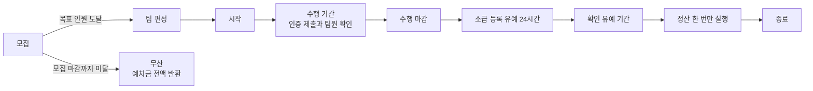
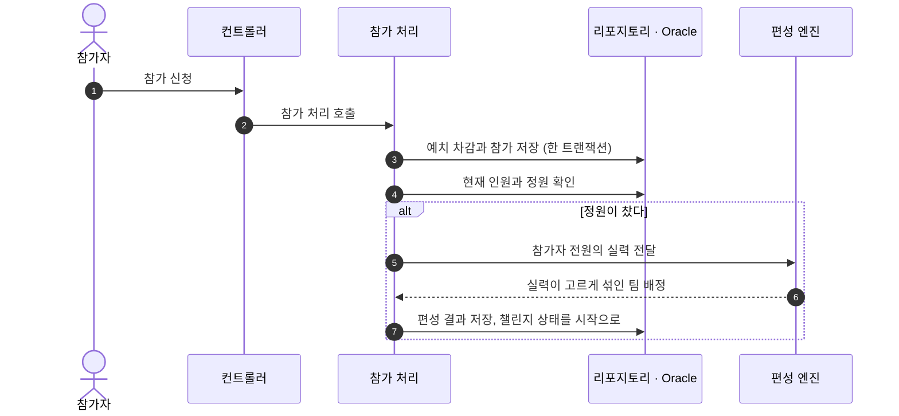
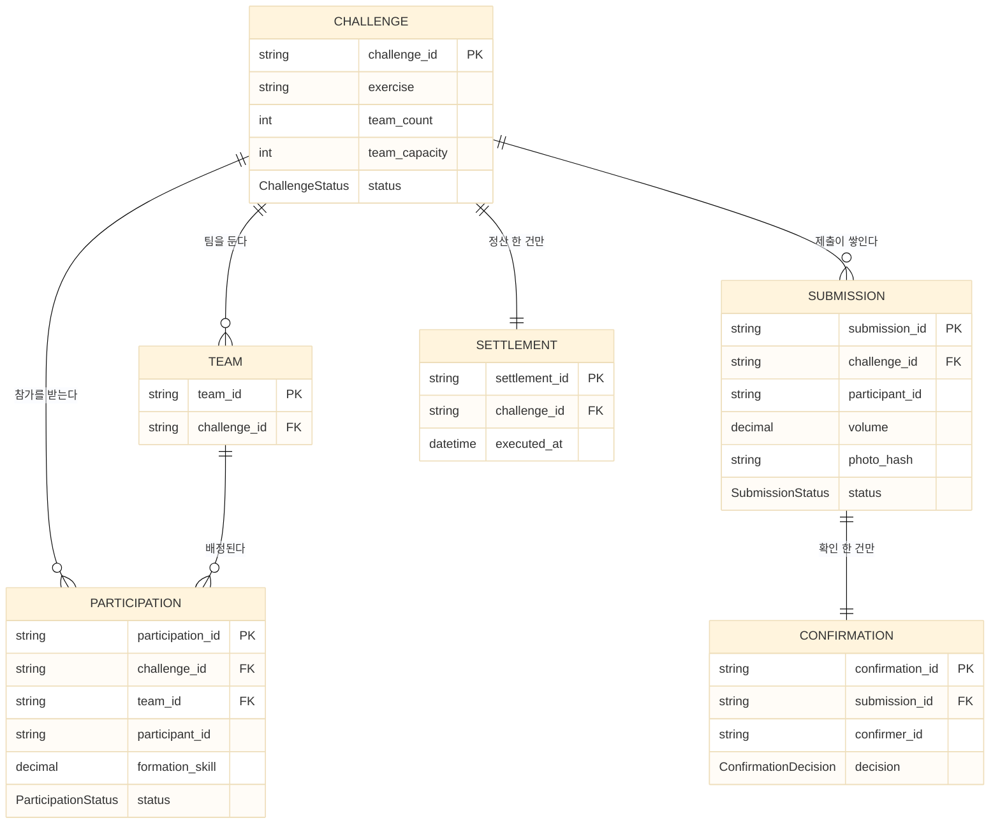

# 팀 대항 등수형 챌린지 서비스


> 운동한 것을 인증으로 남겨 개인과 팀으로 겨루고, 끝날 때 내 목표를 채웠는지와 우리 팀이 몇 등인지로 보상이 나뉘는 챌린지 서비스.

| 항목 | 내용 |
|---|---|
| 개발 형태 | 기획서·요구사항 명세서·설계 명세서를 쓰고, 구현과 시나리오 테스트까지 1인 개발 |
| 대표 챌린지 | 웨이트 트레이닝. 부위 카테고리 안의 종목 하나로 챌린지를 묶는다 |
| 규모 | 도메인 표 11개, 엔드포인트 17개 |
| 배포 | 하지 않았다. 로컬에서만 돌리고 성능도 로컬 기계 한 대에서 측정했다 |

## 목차

1. [프로젝트 소개](#1-프로젝트-소개)
2. [기획 배경](#2-기획-배경)
3. [주요 기능](#3-주요-기능)
4. [구현 화면](#4-구현-화면)
5. [기술 스택](#5-기술-스택)
6. [기술적 이슈와 해결 과정](#6-기술적-이슈와-해결-과정)
7. [시스템 아키텍처](#7-시스템-아키텍처)
8. [ERD](#8-erd)
9. [API](#9-api)
10. [프로젝트 구조](#10-프로젝트-구조)

---

## 1. 프로젝트 소개

참가자를 팀으로 나눠 운동량으로 순위를 매기는 챌린지 서비스다. 대표 챌린지는 웨이트 트레이닝이다.

**개인은 자기 목표를 채우면 예치금을 돌려받고 못 채우면 잃는다. 팀은 팀원들이 쌓은 운동량을 합쳐 다른 팀과 맞붙고, 위쪽 팀이 상금을 받는다.** 내가 올린 인증 한 건은 내 점수와 우리 팀 점수에 함께 들어가므로, 내가 한 만큼이 그대로 팀 점수가 된다.

개인 목표는 그 사람의 운동 수행 능력에서 나온다. 시스템이 최근 기록으로 얼마나 무겁게 들지를 잡아 주면 참가자는 거기에 얼마나 더 얹을지와 며칠에 한 번 할지만 정하고, 그 목표를 채웠는지에 따라 예치금을 돌려받거나 잃는다.

인증은 무게와 횟수를 인증샷과 함께 올린다. 시스템이 먼저 검사하고 나면 같은 팀원이 인증샷을 보고 확인한다.

---

## 2. 기획 배경

### 2.1 시중 서비스는 운동량으로 팀 순위를 매기지 않는다

직장인은 헬스클럽에 등록해도 금방 그만두는데, 이유로 가장 많이 꼽히는 것이 동기가 떨어지는 것이다. 체중 감량이나 근력 향상은 결과가 보이기까지 오래 걸려서, 그 사이를 혼자 세운 목표만으로 버티기가 어렵다.

시중 서비스가 이 문제를 다루는 방식은 셋으로 나뉜다.

| 서비스 | 어디까지 하나 | 무엇을 하지 않나 |
|---|---|---|
| **캐시워크 팀워크** (팀 등수) | 팀 등수를 매기고 순위로 보상한다 | 걸음 수 하나만 세니까 얼마나 했는지는 순위에 들어가지 않는다 |
| 운동 일지 앱 | 무게와 반복 수를 꼼꼼하게 기록한다 | 계속할 마음은 본인 의지에 맡긴다 |
| 습관 앱 | 했는지 안 했는지를 출석처럼 체크한다 | 얼마나 했는지는 세지 않는다 |

셋 다 운동을 얼마나 많이 했는지로 팀끼리 순위를 매기지 않는다.

이 서비스는 개인 목표와 팀 등수를 함께 둔다. 개인은 팀이 몇 등이든 자기 목표를 채우면 예치금을 돌려받고, 팀은 팀원들이 쌓은 운동량을 합쳐 다른 팀과 순위를 매긴다.

### 2.2 개인 목표는 참가자의 운동 수행 능력에서 나온다

목표는 참가자가 마음대로 적는 값이 아니라 그 사람의 최근 수행 능력에서 나온다. 얼마나 자주 할지도 개최자가 챌린지마다 정해 둔 한계 안에서만 고를 수 있는데, 그 한계는 하루에 인증을 몇 번까지 인정할지와 며칠에 한 번 올려야 하는지다.

| 누가 정하나 | 무엇을 정하나 | 어디에 쓰이나 |
|---|---|---|
| 개최자 | 종목, 팀 정원과 팀 수, 상금 받을 팀 수, 모집 기간과 수행 기간, 참가 예치금, 인증 빈도(하루 인증 횟수 상한과 인증 주기) | 챌린지가 성립하는 조건과 팀 누적을 세는 규칙 |
| 시스템 | 참가자의 강도 기준값(그 종목 최근 30일 기록의 1회 평균) | 참가자가 계수를 곱할 바탕(계수는 이 값을 몇 배로 올려 잡을지 정하는 1 이상의 수) |
| 참가자 | 자기 기준값에 곱할 계수(1 이상)와 목표 빈도 | 환급과 차감이 갈리는 기준 |

강도를 참가자가 직접 신고하게 두면 낮춰 적어 목표를 쉽게 만들 수 있다. 그래서 강도는 참가자가 아니라 시스템이 정한다. 그 종목으로 최근 30일 안에 올린 인증의 1회 평균을 기준값으로 잡는다.

하루 인증 횟수에 한계를 두는 것도 같은 이유다. 한계가 없으면 한 사람이 같은 운동을 하루에 수십 번 올려 팀 누적을 끝없이 키울 수 있다.

### 2.3 요구사항 네 가지를 기능 네 가지로 옮겼다

| 필요한 것 | 그것이 만든 기능 |
|---|---|
| 인원이 모여야 시작되는 구조 | 모집 기간과 목표 인원을 미리 정하고, 인원이 차면 시작하고 미달이면 무산하며 예치금을 전액 돌려준다 |
| 시작 전에 등수가 정해지지 않는 편성 | 실력을 고르게 섞어 시스템이 배정하고, 팀 사이 실력 차이를 정해진 범위 안에 둔다 |
| 개인 달성에 대한 보상 보장 | 팀이 몇 등이든 상관없이 자기 목표를 채우면 예치금을 돌려준다 |
| 운동 기간 내내 유지되는 팀 소속 | 확인된 인증의 수행량을 팀 누적에 더해 등수를 매기고 위쪽 팀에 상금을 나눈다 |

이 기능들을 쓸 사람은 혼자 웨이트를 하다가 결과가 보이기 전에 그만둔 20대와 30대 직장인이다.

기획에서 정한 것과 규칙 전문은 [기획서](docs/1.%20팀대항_등수형_챌린지_기획서.md)에 있다.

---

## 3. 주요 기능

기능은 넷이다. 챌린지를 만들어 팀을 짜고, 인증을 올려 팀원이 확인하고, 순위를 매겨 정산하고, 예치금을 관리한다. 각 기능이 무엇을 받아 무엇을 하고 무엇을 내는지 정리하면 이렇다.

| 기능 | 입력 | 하는 일 | 출력 |
|---|---|---|---|
| 챌린지 성립과 팀 편성 | 등록 값과 참가자 전원의 실력 | 상금 받을 팀 수가 전체 팀 수보다 작은지, 예치금이 0보다 큰지, 하루 인증 횟수 상한이 있는지를 검사하고, 정원이 차면 시작 배정 두 개를 맞교환으로 다듬어 팀 사이 실력 합 격차가 허용 범위 안에 든 쪽을 고른다 | 실력이 고르게 섞인 팀들 |
| 인증 제출과 팀원 확인 | 무게, 횟수, 인증샷 | 같은 팀원이 진짜인지 본다 | 확인된 기록만 개인과 팀 누적에 더해진다 |
| 순위와 정산 | 쌓인 수행량과 각자의 목표 | 목표를 채웠는지 가리고, 상금풀을 정하고, 팀 순위로 나누고, 팀 안에서 기여도로 다시 나누는 것을 한 트랜잭션 안에서 한다 | 환급과 차감과 상금 확정 |
| 예치금 관리 | 충전, 참가 차감, 환급, 무산 반환 | 같은 이동이 이미 기록에 있는지 먼저 보고, 기록을 지우지 않고 쌓는다 | 기록 추가와 잔액 갱신 |

한 챌린지가 모집부터 정산까지 가는 순서는 이렇다.


```mermaid
flowchart LR
    A[모집] -->|목표 인원 도달| B[팀 편성]
    A -->|모집 마감까지 미달| V[무산<br/>예치금 전액 반환]
    B --> C[시작]
    C --> D[수행 기간<br/>인증 제출과 팀원 확인]
    D --> E[수행 마감]
    E --> F[소급 등록 유예 24시간]
    F --> G[확인 유예 기간]
    G --> H[정산 한 번만 실행]
    H --> I[종료]
```

화면은 정적 페이지와 API 호출로 만들었다. 가입과 로그인부터 챌린지 등록과 참가, 인증 제출, 팀원 확인, 순위, 예치까지 있다.

기능별 규칙 전문은 [요구사항 명세서](docs/2.%20팀대항_등수형_챌린지_요구사항_명세서.md)에 있다.

---

## 4. 구현 화면

화면은 정적 페이지가 REST API를 불러 그린다. 대표 화면 둘로 참가와 인증 흐름을 보인다.

### 4.1 챌린지 상세와 참가 신청


챌린지의 구성과 상태를 한자리에서 보여 주고, 모집 중이면 그 아래에서 참가 신청을 받는다. 신청이 성립하면 예치금이 차감되고, 마지막 신청으로 정원이 차면 곧바로 팀 편성까지 이어진다.

### 4.2 내 제출 현황


참가자가 올린 인증을 수행 날짜별로 묶어 보여 준다. 각 제출에는 무게·횟수·볼륨과 함께 상태가 확인된다. 상태는 확인 대기에서 시작해, 같은 팀원이 확인하면 확인 완료로 바뀐다.

---

## 5. 기술 스택

| 구분 | 내용 |
|---|---|
| 언어와 빌드 | Java 17, Gradle |
| 프레임워크 | Spring Boot 3.3.5, Spring Web, Spring Data JPA, Spring Validation |
| 로그인과 접근 허용 | Spring Security. JWT를 HttpOnly 쿠키로 주고 서버는 세션을 만들지 않는다 |
| DBMS | Oracle Database. 스키마는 `docs/sql`의 DDL로만 관리한다 |
| 성능 측정 | JMH |
| 화면 | 정적 페이지(HTML, CSS, 바닐라 JS)와 API 호출 |

---

## 6. 기술적 이슈와 해결 과정

두 건 모두 팀 편성에서 나왔다. 참가 인원이 정원을 채우는 순간 편성이 돌고, 그 계산이 끝날 때까지 참가자가 기다린다.

### 6.1 병렬로 얼마나 빨라지는지를 정한 것은 코어 개수가 아니라 검사마다 만드는 객체였다

| 구분 | 내용 |
|---|---|
| 문제 | 편성을 다듬는 계산이 인원 200명 기준으로 한 번에 수 초가 걸린다 |
| 병렬로 돌린 방법 | 교환 후보 하나를 검사하는 작업은 다른 검사 작업과 순서도 없고 서로 기다릴 일도 없어서, 검사 목록을 나눠 fork-join 풀의 워커들이 동시에 돌게 했다 |
| 얼마나 빨라졌나 | 편성 개선 알고리즘 호출 한 번의 순차 대비 병렬 배율이 인원 200명 기준으로 2.42배에서 멈췄고(워커 스레드 12개, 말단 작업 분할 16개), 걸린 시간이 줄어드는 동안 CPU 시간 합은 오히려 늘었다 |
| 원인 | 코어도 GC도 클럭도 아니었다. 두 편차 계산이 스트림으로 합계와 평균을 구하면서 검사마다 객체를 새로 만들었고, 그 양이 편성 한 번에 9.5GB였다 |
| 해결 | 교환 하나로 값이 바뀌는 팀은 20개 중 2개뿐이다. 팀별 합과 제곱합을 미리 구해 두고 바뀐 두 팀만 고쳐 쓰게 바꿨다 |

<details>
<summary>원인을 좁힌 과정</summary>

병렬로 돌렸는데 2.42배에서 멈췄다.

| 측정 항목 | 순차 | 병렬 | 계산 |
|---|---:|---:|---|
| 워커 스레드 개수 | 풀 미사용 | 12 | |
| 말단 작업 분할 개수 | 풀 미사용 | 16 | |
| 호출 한 번에 걸린 시간(ms, 측정 5회 평균) | 3,378.91 | 764.76 | |
| 프로세스 CPU 시간 합(ms, 같은 실행) | 3,375.00 | 6,006.25 | 순차의 1.78배 |

같은 결과를 내는 데 CPU 시간을 더 쓴 것이라, 늘어난 CPU 시간의 후보를 하나씩 측정해 지웠다.

| 후보 | 측정 결과 | 결과 |
|---|---|---|
| 워커 스레드가 아닌 곳에서 쓴 시간이 늘었나 | 프로세스 CPU 시간이 9,884ms 늘 때 워커 스레드가 쓴 시간이 9,866ms 늘어 99.8% | 아니다 |
| 워커가 기다린 것인가 | 검사 반복문에서 보낸 시간의 90%에서 98%가 실제로 코어에서 돌던 시간 | 아니다 |
| 검사 횟수가 늘었나 | 분할을 어떻게 바꿔도 편성 한 번에 855,000회로 같다 | 아니다 |
| CPU 클럭이 내려갔나 | 클럭이 4.257GHz에서 4.081GHz로 4.1% 내려갔지만, 늘어난 검사 시간에서 그 하락으로 설명되는 것은 최대 4.6% | 아니다 |
| 검사 한 번에 걸리는 시간 자체 | 그 시간의 99% 안팎을 두 편차 계산이 쓴다 | 남는다 |

두 편차 계산을 반복문으로 바꿔 객체가 생기지 않게 하자 CPU 시간이 늘어나던 것이 사라졌다. 실행 기록기(JFR)로도 확인했더니 9.5GB의 99.97%가 스트림을 만드는 세 문장에서 나왔다. 서로 다른 두 방법이 같은 답을 냈다.

</details>

| 워커 스레드 개수 | 말단 작업 분할 개수 | 측정 항목 | 바꾸기 전(스트림 구현) | 바꾼 뒤(증분 재계산) | 측정 조건 |
|---|---|---|---:|---:|---|
| 풀 미사용 | 풀 미사용 | 순차 실행 1회 시간(ms) | 4,137.2 | 59.1 | 인원 200명, 정원 10명 |
| 6 | 36 | 병렬 실행 1회가 새로 만드는 객체(MB) | 9,522.1 | 4.44 | 인원 200명, 정원 10명 |

순차 실행 시간의 두 값은 계측 코드가 서로 다른 측정에서 나와, 정밀한 배수 대신 4,000ms대에서 60ms대로 줄었다는 정도로 본다.

빨라진 것의 대부분은 병렬로 돌린 데서가 아니라 편차 계산을 바꾼 데서 왔다. 워커 스레드를 늘리고 분할 개수를 조정하는 것만으로는 2.42배를 넘지 못했다.

운영에서 쓰는 설정은 바꾼 뒤에 다시 정했다. 설정을 바꿔 가며 측정해 가장 빨랐던 워커 스레드 12개에 분할 9로 뒀다.

추적 과정과 표 전부는 [최종 보고서](docs/병목개선/1.%20ForkJoinPool/improve_forkjoin_병렬화_최종보고서.md)와 성능 분석 [1편](docs/병목개선/1.%20ForkJoinPool/improve_forkjoin_병렬화성능분석_1.md)부터 [5편](docs/병목개선/1.%20ForkJoinPool/improve_forkjoin_병렬화성능분석_5.md)까지에 있다.

### 6.2 팀 전체를 살펴보던 시작 배정을 레드블랙 트리로 바꿨다

| 구분 | 내용 |
|---|---|
| 문제 | 시작 배정이 실력 합이 가장 작은 팀을 매번 팀 전체를 하나씩 살펴 찾는다. 정원은 종목이 정해서 거의 고정이라 참가자가 늘면 팀 수도 따라 늘고, 참가자 10배에 시간이 98.1배와 90.1배가 되었다 |
| 어떻게 봤나 | 필요한 것은 팀 전체의 순서가 아니라 합이 가장 작은 팀 하나다. 그 팀 하나를 꺼낼 때 비교를 로그 횟수만 하는 후보 둘, 이진 힙과 레드블랙 트리를 잡았다 |
| 확인할 기준 | 시간이 참가자 수에 비례해서만 늘 것, 팀 수에는 비례하지 않고 로그를 따를 것, 시간과 별개로 센 비교 횟수도 로그를 따를 것. 하나라도 어긋나면 팀 전체를 살펴보는 것보다 낫다고 할 수 없다 |
| 선택 | 팀 수가 작으면 힙이, 크면 트리가 빨랐다. 참가자를 따라 팀 수가 커지는 조건에서 트리가 줄곧 빨라서 레드블랙 트리를 골랐다 |

<details>
<summary>세 기준을 확인한 과정</summary>

**기준 1. 시간이 참가자 수에 비례하는가.** 팀 수를 고정한 채 참가자만 10배씩 늘리자 팀 전체를 살펴보던 것과 두 후보 모두 시간이 10배 근처로 늘었다. 배정이 느려지는 원인이 참가자 수 자체는 아니라는 뜻이고, 남는 것은 팀 수다.

**기준 2. 팀 수에 비례하지 않고 로그를 따르는가.** 참가자를 고정한 채 팀 수만 100배(3개에서 300개)로 늘렸다. 시간이 팀 수에 그대로 비례했다면 100배가 나온다.

| 구현 | 참가자 수 | 팀 수 | 팀 수가 100배일 때 시간 배율(배) |
|---|---:|---|---:|
| 이진 힙 | 3,000 | 3개에서 300개 | 7.19 |
| 이진 힙 | 30,000 | 3개에서 300개 | 6.05 |
| 이진 힙 | 300,000 | 3개에서 300개 | 4.84 |
| 레드블랙 트리 | 3,000 | 3개에서 300개 | 4.18 |
| 레드블랙 트리 | 30,000 | 3개에서 300개 | 4.36 |
| 레드블랙 트리 | 300,000 | 3개에서 300개 | 2.77 |

실측은 모두 한 자릿수라 100배와는 거리가 멀다. 팀 수에 비례하지 않고 로그로 늘어난다는 뜻이다.

**기준 3. 비교 횟수도 로그를 따르는가.** 시간과 별개로, 팀을 고를 때 인원 1명당 비교를 몇 번 하는지 세었다.

| 구현 | 참가자 수 | 팀 수 | 팀 수가 100배일 때 비교 횟수 배율(배) |
|---|---:|---|---:|
| 이진 힙 | 3,000 | 3개에서 300개 | 7.69 |
| 이진 힙 | 30,000 | 3개에서 300개 | 7.58 |
| 이진 힙 | 300,000 | 3개에서 300개 | 7.76 |
| 레드블랙 트리 | 3,000 | 3개에서 300개 | 5.87 |
| 레드블랙 트리 | 30,000 | 3개에서 300개 | 5.58 |
| 레드블랙 트리 | 300,000 | 3개에서 300개 | 6.56 |

실측은 모두 한 자릿수라 100배와는 거리가 멀다. 비교 횟수도 팀 수에 비례하지 않고 로그로 늘어난다. 시간과 비교 횟수가 서로 다른 방법으로 같은 답을 냈다.

</details>

세 방식을 같은 조건(정원 10명)에서 비교한 결과다. 팀 전체를 살펴보던 방식은 참가자가 늘수록 시간이 제곱에 가깝게 커지지만, 힙과 트리는 팀 하나를 로그 시간에 꺼내 거의 선형으로만 늘어난다. 그래서 참가자 30만 명에서 배정 한 번이 8.9초에서 수십 밀리초로 줄었고, 참가자를 따라 팀 수가 커지는 이 조건에서는 트리가 힙보다 빨랐다.

| 구현 | 배정 한 번에 걸리는 시간(ms, 참가자 30만 명) | 참가자 10배당 시간 배율(배, 3천에서 3만) | 참가자 10배당 시간 배율(배, 3만에서 30만) |
|---|---:|---:|---:|
| 팀 전체 살펴보기 | 8,895.7 | 98.1 | 90.1 |
| 이진 힙 | 58.3 | 12.5 | 11.7 |
| 레드블랙 트리 | 46.6 | 11.1 | 11.3 |

측정은 벤치마크 도구(JMH)로 했고 환경은 Windows에 JDK 17이다. 실험을 어떻게 짰는지와 값 전부는 시간 복잡도 실측 보고서 세 편, [1편(팀 전체 살펴보기)](docs/병목개선/2.%20seedGreedy_알고리즘_시간복잡도/1.%20seedGreedy_시간복잡도_1차테스트_실측_보고서_JMH.md)와 [2편(이진 힙)](docs/병목개선/2.%20seedGreedy_알고리즘_시간복잡도/2.%20seedGreedy_시간복잡도_실측_보고서_우선순위큐_JMH.md)과 [3편(레드블랙 트리)](docs/병목개선/2.%20seedGreedy_알고리즘_시간복잡도/3.%20seedGreedy_시간복잡도_실측_보고서_레드블랙트리_JMH.md)에 있다.

---

## 7. 시스템 아키텍처

### 7.1 전체 구성

Java 17과 Spring Boot로 만든 REST API 프로젝트다. 아키텍처 구성 요소별로 맡는 기능과 쓴 기술은 이렇다.

| 아키텍처 구성 요소 | 기능 | 기술 |
|---|---|---|
| 인증 · 인가 | 로그인 확인과 접근 허용 | Spring Security · JWT |
| 편성 엔진 | 정원이 차면 실력을 고르게 섞어 팀 배정 | 자체 알고리즘 · ForkJoinPool 병렬 |
| 저장소 | 데이터는 표로, 인증샷 원본은 파일로 보관 | Spring Data JPA · Oracle · 로컬 파일 |

네 기능을 API · 비즈니스 · 저장소 세 계층으로 설계하였다.


### 7.2 팀 편성

챌린지는 참가자가 모집 정원을 다 채워야 시작된다. 시작하기 전에 참가자들을 실력이 한쪽으로 쏠리지 않도록 여러 팀에 고르게 나누는데, 이 팀을 구성하는 작업이 팀 편성이다.


```mermaid
sequenceDiagram
    autonumber
    actor P as 참가자
    participant C as 컨트롤러
    participant S as 참가 처리
    participant R as 리포지토리 · Oracle
    participant E as 편성 엔진

    P->>C: 참가 신청
    C->>S: 참가 처리 호출
    S->>R: 예치 차감과 참가 저장 (한 트랜잭션)
    S->>R: 현재 인원과 정원 확인
    alt 정원이 찼다
        S->>E: 참가자 전원의 실력 전달
        E-->>S: 실력이 고르게 섞인 팀 배정
        S->>R: 편성 결과 저장, 챌린지 상태를 시작으로
    end
```

편성이 이뤄지는 과정은 이렇다.

1. 현재 인원이 정원을 채웠는지 확인한다.
2. 정원이 찼으면 같은 요청 안에서 참가자 전원의 실력을 편성 엔진에 전달한다.
3. 엔진은 실력이 고르게 섞이도록 팀 배정을 계산해 결과만 돌려준다.
4. 참가 처리가 그 결과로 팀과 배정을 저장하고, 챌린지 상태를 시작으로 바꾼다.

내부 구성과 데이터 흐름은 [설계 명세서](docs/3.%20팀대항_등수형_챌린지_설계명세서.md) 2절과 5절에 있다.

---

## 8. ERD

핵심 표 여섯 개와 그 관계다. 컬럼은 주요한 것만 추렸다.


```mermaid
%%{init: {'theme':'base','themeVariables':{'fontFamily':'Malgun Gothic, Segoe UI, sans-serif'}}}%%
erDiagram
    CHALLENGE ||--o{ TEAM : "팀을 둔다"
    CHALLENGE ||--o{ PARTICIPATION : "참가를 받는다"
    TEAM ||--o{ PARTICIPATION : "배정된다"
    CHALLENGE ||--o{ SUBMISSION : "제출이 쌓인다"
    SUBMISSION ||--|| CONFIRMATION : "확인 한 건만"
    CHALLENGE ||--|| SETTLEMENT : "정산 한 건만"

    CHALLENGE {
        string challenge_id PK
        string exercise
        int team_count
        int team_capacity
        ChallengeStatus status
    }
    PARTICIPATION {
        string participation_id PK
        string challenge_id FK
        string team_id FK
        string participant_id
        decimal formation_skill
        ParticipationStatus status
    }
    TEAM {
        string team_id PK
        string challenge_id FK
    }
    SUBMISSION {
        string submission_id PK
        string challenge_id FK
        string participant_id
        decimal volume
        string photo_hash
        SubmissionStatus status
    }
    CONFIRMATION {
        string confirmation_id PK
        string submission_id FK
        string confirmer_id
        ConfirmationDecision decision
    }
    SETTLEMENT {
        string settlement_id PK
        string challenge_id FK
        datetime executed_at
    }
```

| 표 | 저장 내용 | 제약 조건 |
|---|---|---|
| `CHALLENGE` | 챌린지 하나의 구성과 상태 | 성립 조건(상금 팀 수가 팀 수보다 작고, 예치금은 0보다 크고, 하루 상한은 1 이상)과 기간 순서(종료가 시작보다 뒤)를 값 검사로 확인. 상태·인증 주기는 정해진 값만 허용 |
| `TEAM` | 챌린지에 속한 팀 | 챌린지를 외래 키로 참조 |
| `PARTICIPATION` | 신청, 정해진 실력과 목표, 배정된 팀, 예치 상태 | 챌린지·참가자 조합이 유니크라 같은 챌린지 중복 신청 차단. 강도 계수는 1 이상, 상태는 진행·이탈만 |
| `SUBMISSION` | 인증 제출과 그 상태 변화. 기준 측정도 구분 값을 붙여 함께 | 챌린지·사진 해시 조합이 유니크라 같은 사진 재사용 차단. 무게는 0보다 크고 횟수는 1 이상, 상태는 대기·확인·반려·만료만 |
| `CONFIRMATION` | 팀원이 확인하거나 반려한 것 한 건 | 제출이 유니크라 확인은 한 건만. 값은 확인·반려만 |
| `SETTLEMENT` | 정산을 실행한 기록 | 챌린지가 유니크라 정산은 한 번만 |

위 표에는 도메인의 핵심만 간추렸다. 나머지 표와 전체 컬럼·제약은 [설계 명세서](docs/3.%20팀대항_등수형_챌린지_설계명세서.md) 7절에, 실제 DDL은 [docs/sql](docs/sql)에 있다.

---

## 9. API

REST 엔드포인트는 챌린지 도메인 13개와 회원 4개, 모두 17개다. 각 엔드포인트의 메서드·경로와 접근 조건은 다음과 같다.

<details>
<summary>엔드포인트 17개 펼쳐 보기</summary>

**챌린지 도메인**

| 기능 | 메서드와 경로 | 접근 조건 |
|---|---|---|
| 챌린지 등록 | `POST /api/challenges` | 로그인 |
| 챌린지 목록 조회 | `GET /api/challenges` | 공개 |
| 챌린지 상세 조회 | `GET /api/challenges/{challengeId}` | 공개 |
| 참가 신청 | `POST /api/challenges/{challengeId}/participations` | 로그인 |
| 기준 측정 제출 | `POST /api/challenges/{challengeId}/participations/baseline-measurement` | 로그인 |
| 인증 제출 | `POST /api/challenges/{challengeId}/submissions` | 그 챌린지 참가자 |
| 내 제출 현황 | `GET /api/challenges/{challengeId}/submissions/me` | 참가자 본인 |
| 확인 대기 목록 | `GET /api/challenges/{challengeId}/submissions/pending` | 같은 팀원 |
| 팀원 확인 | `POST /api/submissions/{submissionId}/confirmations` | 같은 팀원, 본인 제출 제외 |
| 인증샷 조회 | `GET /api/submissions/{submissionId}/photo` | 같은 챌린지 참가자 |
| 순위와 현황 조회 | `GET /api/challenges/{challengeId}/rankings` | 그 챌린지 참가자 |
| 예치금 충전 | `POST /api/deposits` | 로그인 |
| 예치 현황 조회 | `GET /api/deposits/me` | 로그인 |

**회원**

| 기능 | 메서드와 경로 | 접근 조건 |
|---|---|---|
| 가입 | `POST /members/join` | 공개 |
| 로그인 성공 확인 | `GET /members/loginSuccess` | 로그인 |
| 회원 조회 | `GET /members/edit` | 로그인 |
| 정보 수정 | `POST /members/edit` | 로그인 |

</details>

에러 코드는 등록·신청·제출·확인·조회·예치로 나뉜다. 엔드포인트별 상세는 [설계 명세서](docs/3.%20팀대항_등수형_챌린지_설계명세서.md) 6절에, 경로별 접근 권한은 [권한 체계 설계안](docs/설계/인증_권한체계_설계안.md)에 있다.

---

## 10. 프로젝트 구조

```
src/main/java/com/exercisemanagement/
├── auth/                  JWT 발급과 검증, Security 필터 체인
├── members/               회원 가입과 조회와 수정
└── challenge/             핵심 도메인
    ├── controller/        요청을 받고 누가 보냈는지 꺼낸다 (8개)
    ├── service/           도메인 규칙 (10개)
    ├── repository/        Spring Data JPA (11개)
    ├── entity/            테이블 매핑 (11개)
    ├── dto/               요청 7개와 응답 15개
    ├── support/           GoalEvaluator, IdGenerator, PhotoStorage, PhotoMetadataValidator
    ├── scheduler/         ChallengeLifecycleScheduler
    ├── common/            상태와 유형 enum 7종
    ├── exception/         ErrorCode 27종과 전역 핸들러
    └── config/            ChallengeProperties, SchedulingConfig

src/jmh/java/    ImproveBench, SeedGreedyBench, SeedGreedyBranchCount
src/test/java/   ImproveEquivalenceCheck(순차와 병렬의 결과가 같은지), ImproveCpuUtilizationProbe
docs/            기획서부터 성능 개선 보고서와 측정 원본까지
```
