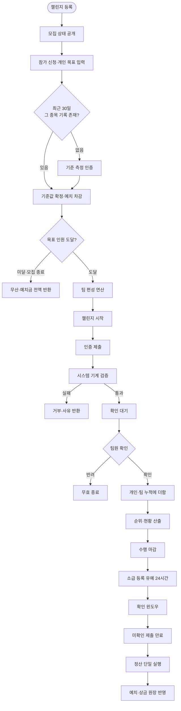
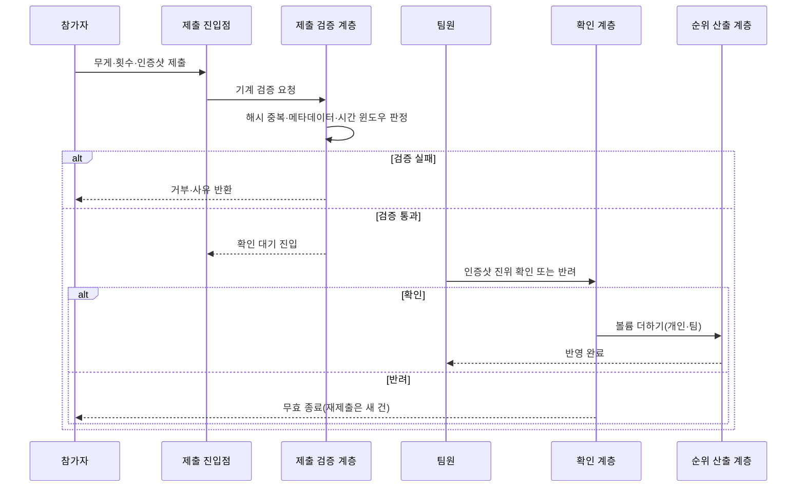
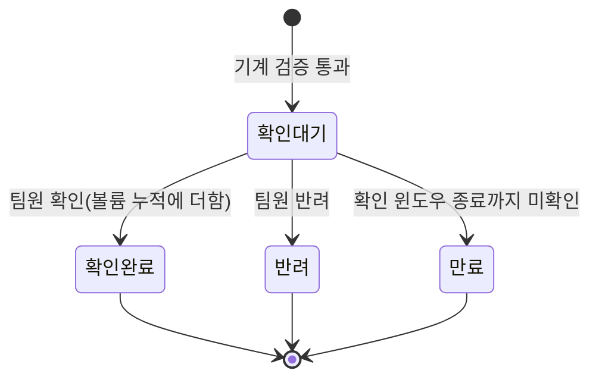

# 팀 대항 등수형 챌린지 서비스 설계 명세서

프로젝트명: 팀 대항 등수형 챌린지 서비스
문서 버전: v1.4
작성일: 2026년 07월 03일
작성자: 정범진

---

## 목차

1. [개요](#1-개요)
2. [시스템 전체 개요](#2-시스템-전체-개요)
3. [일반 요구사항](#3-일반-요구사항)
4. [기존 서비스 구조 분석과 차별점](#4-기존-서비스-구조-분석과-차별점)
5. [시스템 아키텍처](#5-시스템-아키텍처)
6. [API 명세](#6-api-명세)
7. [데이터 모델](#7-데이터-모델)
8. [핵심 비즈니스 로직](#8-핵심-비즈니스-로직)
9. [스케줄 처리 명세](#9-스케줄-처리-명세)
10. [실시간 서비스 명세](#10-실시간-서비스-명세)
11. [구현 기술 스택](#11-구현-기술-스택)
12. [부록](#12-부록)

---

## 1. 개요

### 1.1 목적

이 시스템은 디바이스 자동 측정 없이 운동 수행을 검증하고, 개인 목표 달성과 팀 순위라는 두 계층의 보상과 정산을 정합성 있게 처리하는 것을 목표로 한다.

첫 번째 문제는 수행을 믿을 근거가 없다는 점이다. 걸음 수나 심박은 디바이스가 수치를 자동으로 재주지만, 웨이트 트레이닝의 무게와 횟수는 그렇지 않다. 그래서 이 시스템은 검증을 두 단계로 나눈다. 참가자가 수행을 인증샷으로 올리면 시스템이 같은 사진의 중복 제출과 인증 빈도 위반을 기계적으로 걸러내고, 그다음 팀원이 그 인증샷의 진위를 직접 판정한다. 점수를 바꾸는 것은 제출이 아니라 이 팀원 확인이다.

두 번째 문제는 개인 보상과 팀 보상을 정합성 있게 맞추는 일이다. 참가자의 인증 한 건은 두 보상에 서로 다른 방식으로 반영된다. 개인 쪽에서는 목표를 달성했는지 못했는지로만 가르고, 팀 쪽에서는 볼륨이라는 실제 수행량으로 계산한다. 정산 때 목표를 못 채운 참가자에게서 차감한 금액이 팀 상금의 재원으로 들어가므로, 두 보상은 이 차감액을 통해 하나로 이어진다. 이 연결이 어긋나면 금액이 맞지 않아 정산이 끝나지 않는다.

### 1.2 범위

이 설계 명세서는 챌린지 등록부터 정산까지의 핵심 기능에 대한 계약과 설계 의미를 정의한다. 대상 기능은 챌린지 등록과 성립 검증, 챌린지 목록·상세 조회, 참가 신청, 기준 측정 인증, 팀 편성, 인증 제출과 시스템 검증, 내 제출 현황 조회, 팀원 확인과 점수 반영, 순위와 개인 목표 현황 산출과 조회, 마감과 확인 윈도우, 정산, 예치 충전이다.

이 문서는 각 기능이 무엇을 하고 왜 그렇게 설계되었는지를 정의하며, 구현 방법까지 미리 못 박지는 않는다. 구현 방법을 미리 정하지 않는 이유는 계측을 먼저 하기 위해서다. 실제 병목을 재보기 전에 최적화 방법을 설계에서 고정하면, 병목이 아닌 곳을 최적화하거나 계측 결과와 맞지 않는 구조를 미리 확정할 위험이 있다. 그래서 계산량을 줄이는 방법이나 자료구조 선택 같은 결정은 기준 구현이 돌아간 뒤 계측 결과를 보고 따로 정한다.

다음 항목은 이 설계의 범위 밖이며 후속 단계에서 확정한다.

- 팀 편성 CPU 바운드 구간의 병렬 분할, 교환 후 편차의 증분 재계산 같은 계산량을 줄이는 수단. 근거와 범위 경계는 섹션 8.1에서 정의한다.
- 순위 산출의 정렬 유지와 순위 조회를 뒷받침할 자료구조와 구현체 선택, 동시성 최적화. 근거는 섹션 8.3과 섹션 10에서 정의한다.
- 응답 시간, 동시 처리량, 가용률 같은 정량 성능 목표. 근거 데이터가 없어 아직 재지 않은 상태로 둔다. 섹션 3.2에서 다룬다.
- 권한 체계 세부, 데이터 암호화, 감사 로깅 정책.
- 입출력 데이터 모델의 구체 타입, 식별자 형식, 시각 표현 형식.

---

## 2. 시스템 전체 개요

### 2.1 핵심 아키텍처 요약

**검증을 기계와 사람으로 나눈다**
수행을 재주는 디바이스가 없으므로, 이 서비스는 인증을 믿을 수 있게 만들 다른 방법이 필요하다. 그래서 검증을 두 단계로 나누고 판정하는 주체를 분리한다. 시스템은 사진 해시 중복, 사진 메타데이터 정합성, 인증 시간 윈도우(하루 횟수 상한과 인증 주기)를 기계적으로 판정한다. 이 단계를 통과한 제출은 확인 대기 상태가 되고 아직 점수에는 반영되지 않는다. 팀원은 인증샷이 실제 그 수행을 담았는지를 직접 판정한다. 확인이 확정되는 순간 그 제출의 볼륨이 개인 누적과 팀 누적에 함께 더해진다. 기계가 잡을 수 있는 부분과 사람만 잡을 수 있는 부분을 이렇게 나눠 맡기기 때문에, 자동 측정이 안 되는 종목도 챌린지로 다룰 수 있다.

**같은 제출을 개인과 팀이 다르게 쓴다**
한 제출의 무게와 횟수는 개인 보상과 팀 보상에서 서로 다르게 쓰인다. 개인 보상은 목표를 달성했는지 못했는지로만 가르고, 목표를 넘긴 초과분은 환급에 더 쳐주지 않는다. 개인 쪽은 든 볼륨의 크기를 따지지 않으므로 무게나 횟수를 부풀릴 이유가 없다. 팀 점수와 기여도는 실제 수행량으로 매긴다. 볼륨은 무게에 횟수를 곱한 값이고, 확인 완료된 제출의 볼륨을 기간 내내 더한 합이 그 사람이 팀에 보탠 양이다. 같은 데이터를 개인 쪽에서는 목표를 넘겼는지로, 팀 쪽에서는 크기로 해석한다.

**편성의 두 균형과 역할 분담**
팀 대항이 공정하려면 두 가지 균형이 맞아야 한다. 하나는 팀 사이 전력 총합이 비슷한 합 균형이고, 다른 하나는 팀 안 실력 구성이 팀끼리 비슷한 분포 균형이다. 이 둘은 서로 부딪친다. 분포를 고치는 교환은 실력이 다른 두 사람을 맞바꾸는 것이라, 그 실력 차이만큼 팀 합도 같이 움직이기 때문이다. 그래서 편성은 두 균형을 점수 하나로 합쳐 최적화하지 않고 역할을 다르게 나눈다. 합 균형은 넘으면 안 되는 제약으로 두고, 분포 균형은 그 제약 안에서 최대한 줄이는 목표로 둔다. 이 결정의 근거와 절차는 섹션 8.1에서 정의한다.

**정산의 금액 연결과 단일 실행**
정산은 개인 판정부터 팀 내 분배까지 순서가 정해진 네 단계로 이뤄지고, 앞 단계 결과가 뒤 단계 입력이 된다. 목표를 못 채운 참가자에게서 차감한 금액이 팀 상금의 재원으로 들어가므로, 개인 정산과 팀 정산이 이 차감액으로 이어진다. 정산은 일부만 반영되어서는 안 되고 전부 반영되거나 전부 반영되지 않아야 하며, 금액이 서로 맞아떨어져야 끝난다. 정산이 두 번 실행되면 돈이 이중으로 지급되므로, 정산은 확인 윈도우가 끝나는 시점에 단 한 번만 실행된다. 이 계층의 정합성 규칙은 섹션 8.4에서 정의한다.

**주요 구성요소**
- 쓰기 경로 진입점과 서비스 계층: 챌린지 등록, 참가 신청과 예치 차감, 인증 제출, 팀원 확인, 예치 충전을 접수하고 각 도메인 규칙을 적용한다.
- 팀 편성 연산: 외부 요청이 아니라 참가 인원이 목표에 도달하는 순간 내부에서 실행되는 계산이다. 참가자 전체와 편성 실력을 입력으로 받아 팀 배정 하나를 출력한다.
- 순위 산출 계층: 확인 한 건이 확정될 때마다 개인 누적과 팀 누적에 그만큼 더하고, 팀 순위와 팀 내 기여도 순위, 개인 목표 달성 현황을 산출한다.
- 마감·윈도우 스케줄러: 수행 마감과 확인 윈도우 종료를 시각 기준으로 감지하고, 만료 처리와 정산 실행을 시작한다.
- 정산 계층과 원장 저장소: 개인 환급·차감과 팀 상금 분배를 네 단계로 처리하고, 예치와 상금 이동을 원장에 append 방식으로 기록한다.

### 2.2 전체 데이터 처리 흐름도



**흐름도 설명**
1. **등록과 모집**: 등록자가 단일 종목과 팀 구성, 기간, 인증 빈도를 정하면, 성립 제약을 통과한 챌린지가 모집 상태로 공개된다. 성립 제약을 이 시점에 검사하므로 잘못된 구성으로 이후 단계가 진행되는 일이 없다.
2. **신청과 실력 확정**: 참가자가 개인 목표를 담아 신청 요청을 보내면, 시스템이 그 종목의 최근 30일 확인 완료 기록을 조회한다. 기록이 있으면 기준값을 확정하고 예치금을 차감해 신청이 완료된다. 기록이 없으면 시스템이 응답으로 기준 측정을 추가로 요청하고, 참가자가 인증을 올려 검증을 통과하면 그때 기준값 확정과 예치 차감이 이뤄진다. 강도 하한은 어느 경우든 기준값이 확정된 뒤에 계수를 곱해 계산한다.
3. **편성과 시작**: 목표 인원이 차는 순간 편성 연산이 참가자 전체를 팀으로 나누고 챌린지를 시작 상태로 넘긴다. 인원이 모자란 채 모집이 끝나면 챌린지는 무산되고 예치금이 전액 반환된다.
4. **제출과 검증과 반영**: 제출은 기계 검증을 통과해야 확인 대기로 남고, 팀원 확인이 확정되어야 볼륨이 개인 누적과 팀 누적에 더해진다. 점수를 바꾸는 지점이 팀원 확인 하나로 고정된다.
5. **마감과 정산**: 수행 마감 뒤 소급 등록 유예 24시간 동안 수행 기간 안의 날짜를 지정한 늦은 제출을 받고, 그 유예가 끝나면 제출이 완전히 마감된다. 이어서 확인 윈도우가 늦은 확인을 받아주고, 윈도우가 끝나는 시점에 확인 안 된 제출이 만료 처리되며 정산이 단 한 번 실행된다.

### 2.3 주요 컴포넌트 간 상호작용

인증 제출부터 점수 반영까지의 상호작용을 서술한다. 이 경로에서 검증을 기계와 사람으로 나눈 구조와, 확인할 때마다 누적에 더하는 처리가 실제로 맞물린다.



**상호작용 설명**
- 제출 진입점에서 제출 검증 계층으로: 무게와 횟수와 인증샷을 넘기고, 검증 계층은 판정 결과에 따라 확인 대기 진입이나 거부를 돌려준다. 검증을 통과하지 못한 제출은 확인 큐에 올라오지 않으므로, 중복 제출이나 빈도 위반처럼 기계가 이미 걸러낸 제출을 팀원이 다시 볼 일이 없다.
- 확인 계층에서 순위 산출 계층으로: 확인 한 건이 확정되면 그 제출의 볼륨을 개인 누적과 팀 누적 두 곳에 더한다. 개인 기록 전체를 다시 합산하지 않고 이번 건만 더하므로, 순위를 갱신하는 비용이 확인 건수에 비례한다.

---

## 3. 일반 요구사항

### 3.1 기술 요구사항

- **데이터 형식**: 기본은 JSON(application/json). 다만 기준 측정 제출과 인증 제출 두 엔드포인트는 인증샷을 함께 받아야 하므로 multipart/form-data를 쓴다. 이 두 요청은 무게·횟수를 담은 JSON 메타 파트와 인증샷 파일 파트를 함께 보내며, 구성은 섹션 7.2.4에서 정의한다.
- **문자 인코딩**: UTF-8.
- **인증 방식**: 사용자 인증과 회원 관리는 Spring Security 기반으로 한다. 로그인 요청의 아이디와 비밀번호는 인증 필터가 검증하고, 인증에 성공하면 JWT를 발급해 HttpOnly 쿠키로 전달한다. 서버는 세션을 생성하지 않는 무상태 정책으로 매 요청의 JWT를 검증하며, 비밀번호는 BCrypt로 암호화해 저장한다. 회원 데이터를 포함한 이 프로젝트의 DBMS 계정과 스키마는 전용으로 분리해 운용한다. 권한 체계는 이 프로젝트의 도메인에 맞춰 따로 정하며 세부는 구현 단계에서 확정한다. 다만 본인이 자기 제출을 확인하는 것을 막는 규칙은 도메인 규칙으로 섹션 8.2에서 정의한다.
- **기본 URL**: 미정. 배포 환경 확정 시 결정한다.

### 3.2 성능 요구사항

응답 시간, 동시 처리량, 가용률 같은 정량 목표는 근거 데이터가 없어 아직 재지 않은 상태로 둔다. 추정으로 채우지 않으며, 기준 구현을 계측한 뒤에 정한다.

정량 목표와 별개로, 계산 부하가 몰리는 구간이 어디인지는 미리 밝혀 둔다. 팀 편성의 교환 반복은 반복 한 번마다 팀 짝 수와 사람 짝 수를 곱한 만큼 후보를 평가하는 CPU 바운드 구간이다. 반복 한 번의 후보 수는 팀 수 K와 팀 정원 N에 대해 K(K−1)/2 × N²이고, 여기에 정지까지 돈 반복 횟수가 곱해진다. 이 구간의 계산량을 줄이는 방법은 이 설계의 범위 밖이며, 근거는 섹션 8.1에서 정의한다. 이 내용은 설계 원칙이 아니라 부하가 어디에 몰리는지를 밝힌 것이라 이 자리에 둔다.

---

## 4. 기존 서비스 구조 분석과 차별점

이 프로젝트는 새로 만드는 것이라 고쳐야 할 기존 코드가 없다. 그래서 이 섹션은 기존 코드를 분석하는 대신, 시중 챌린지 서비스가 지금 어떻게 돌아가는지를 보고 이 설계가 어떤 부분을 다르게 잡았는지를 정리한다.

### 4.1 기존 챌린지 서비스의 구조와 한계

| 구현 부분 | 현재 로직 | 한계 | 설계 영향 |
|-----------|-----------|------|-----------|
| 보상 구조 | 개인 달성률에 따른 예치금 환급이 핵심 구조 | 참가자 간 비교와 경쟁의 축이 없어 개인 목표 달성으로 흐름이 종료됨 | 등수 경쟁이 만드는 지속 참여와 재도전 동기가 약함 |
| 경쟁 단위 | 개인 단위 경쟁만 존재 | 팀 단위 협력과 대항 구조가 없음 | 팀 편성과 팀 정산 같은 집단 경쟁 동학이 발생하지 않음 |

### 4.2 이 설계가 다르게 잡은 핵심

**개인 보상과 팀 경쟁을 계층으로 나눔**
개인은 팀 등수와 상관없이 자기 목표만 달성하면 기본 보상을 받고, 팀은 볼륨 누적 합으로 다른 팀과 겨룬다. 두 보상을 따로 두되, 정산에서 목표를 못 채운 참가자의 차감액으로 연결한다. 개인 보상이 보장되니 결과가 아직 안 보여도 중도에 포기하지 않게 되고, 팀 대항이 계속 참여할 동기를 만든다.

**단일 종목으로 묶어 무게를 바로 비교**
하나의 챌린지는 부위 카테고리가 아니라 그 안의 한 종목으로 묶는다. 같은 종목 안에서는 무게가 바로 비교되므로 종목 사이의 무게를 환산할 규칙이 필요 없다. 종목이 정해진 목록 안에 있어 같은 운동이 여러 이름으로 갈라지지 않고, 무게 비교와 종목별 집계가 깔끔하게 이뤄진다.

**팀원 확인과 사진 검증으로 자동 측정을 대신함**
디바이스 자동 측정 없이 팀원 확인과 사진 해시·메타데이터 검증으로 인증을 믿을 수 있게 만든다. 그래서 자동 측정이 안 되는 종목도 챌린지로 다룰 수 있다.

---

## 5. 시스템 아키텍처

### 5.1 아키텍처 개요

시스템은 쓰기 경로 진입점과 서비스 계층, 내부 연산 계층(팀 편성), 순위 산출 계층, 조회 계층(챌린지 목록·상세, 순위·현황, 내 제출 현황 읽기), 스케줄 계층(마감·윈도우·정산), 영속 계층으로 이뤄진다. 쓰기 경로는 외부 요청을 받아 도메인 규칙을 적용하고 그 결과를 영속 계층에 저장한다. 팀 편성은 외부 요청 없이 참가 인원이 다 찼다는 내부 조건으로 실행된다. 순위 산출은 팀원 확인이 하나 확정될 때마다 그 볼륨만큼 더해 갱신된다. 정산은 시각 기준 스케줄에 따라 단 한 번 실행된다. 조회 계층은 상태를 바꾸지 않고, 챌린지의 공개 구성, 순위 산출 계층이 유지하는 누적, 요청자 본인의 제출 내역을 읽어 반환하며, 쓰기 경로와 별도 컴포넌트로 둔다. 이렇게 상태를 바꾸는 계기가 계층마다 다르다는 점이 이 아키텍처의 특징이고, 계층마다 필요한 정합성도 다르므로 섹션 8에서 계층별로 정의한다.

### 5.2 시스템 구성 요소

아래 표는 컴포넌트 이름을 확정해 두는 자리다. 본문에서 흐름을 서술할 때는 이름 대신 역할로 가리킨다.

| 구성 요소 | 역할 | 신규/확장 |
|-----------|------|-----------|
| ChallengeRegistrationController | 챌린지 등록 요청 진입점 | 신규 |
| ChallengeRegistrationService | 챌린지 성립 제약 검사와 모집 상태 공개 | 신규 |
| ChallengeQueryController | 챌린지 목록·상세 조회 요청 진입점 | 신규 |
| ChallengeQueryService | 챌린지의 공개 구성과 신청 완료 인원을 읽어 목록·상세 응답을 구성 | 신규 |
| ParticipationController | 참가 신청 요청 진입점 | 신규 |
| ParticipationService | 신청 접수, 실력·기준값 확정, 예치 차감, 인원 도달 판정, 무산 판정과 예치 전액 반환 | 신규 |
| SubmissionValidationService | 인증 제출 기계 검증(해시·메타데이터·시간 윈도우) | 신규 |
| SubmissionQueryController | 내 제출 현황 조회 요청 진입점 | 신규 |
| SubmissionQueryService | 요청자 본인의 일반 인증 제출을 수행 날짜 단위로 읽어 조회 응답을 구성 | 신규 |
| PeerConfirmationService | 팀원 확인·반려와 볼륨을 개인·팀 누적에 더함 | 신규 |
| TeamFormationEngine | 참가 인원 충족 시 팀 배정 산출 | 신규 |
| RankingService | 팀 순위, 팀 내 기여도 순위, 개인 목표 현황 산출 | 신규 |
| RankingQueryController | 순위·현황 조회 요청 진입점 | 신규 |
| RankingQueryService | 순위 산출 계층이 유지하는 누적·정렬 상태를 읽어 조회 응답(팀 순위, 자기 팀 경계, 팀 내 기여도, 개인 목표 현황)을 구성 | 신규 |
| ChallengeLifecycleScheduler | 마감·확인 윈도우 종료 감지, 만료 처리, 정산 실행 | 신규 |
| SettlementService | 개인 환급·차감, 팀 상금 순위·기여도 분배, 단일 실행 | 신규 |
| DepositService | 모의 충전과 잔액 반영, 챌린지별 예치 상태 추적 | 신규 |
| DepositLedgerRepository | 예치 이동 append 기록 저장소 | 신규 |
| TeamPrizeRepository | 팀 몫 분배 기록 저장소 | 신규 |
| MemberPrizeRepository | 팀원 분배 기록 저장소 | 신규 |

### 5.3 데이터 흐름

쓰기 경로 진입점이 받은 요청은 서비스 계층에서 도메인 규칙을 통과한 뒤 영속 계층에 저장된다. 팀원 확인이 하나 확정되면 순위 산출 계층의 개인 누적과 팀 누적에 그 제출의 볼륨이 더해진다. 정산 계층은 확인 완료 볼륨 누적과 개인 목표 달성 여부를 입력으로 받아 예치 원장과 상금 분배 기록(팀 몫, 팀원 분배)에 금액 이동을 남긴다. 확인 완료 제출과 원장 기록의 원본은 영속 계층에 있고, 순위 산출 계층의 누적은 그 원본에서 계산해 낸 값이다.

---

## 6. API 명세

이 섹션은 핵심 API를 정의한다. 6.1부터 6.4까지는 상태를 바꾸는 쓰기 요청이고, 6.5부터 6.7까지는 상태를 바꾸지 않는 읽기 요청이다. 요청·응답 필드의 구체적인 타입과 식별자 형식은 뒤로 미룬 항목이므로, 아래 표에서는 논리 타입과 의미만 정하고 실제 타입은 구현 단계에서 확정한다. 공통 에러 코드는 섹션 6.8에서 한 번만 정의하고, 각 API의 실패 응답 표에서는 코드만 가리킨다.

### 6.1 챌린지 등록

| 항목 | 내용 |
|------|------|
| 기능 설명 | 단일 종목 인스턴스를 생성하고 성립 제약을 검사해 모집 상태로 공개 |
| HTTP Method | POST |
| Endpoint URL | /api/challenges |

#### 6.1.1 요청

**Request Body**

| 필드 | 논리 타입 | 필수 | 설명 |
|------|-----------|------|------|
| category | 문자열(정해진 목록) | ✓ | 시스템이 미리 정한 부위 카테고리 중 하나 |
| exercise | 문자열(정해진 목록) | ✓ | 선택 카테고리 안의 종목 하나. 자유 입력 불가 |
| teamCapacity | 정수 | ✓ | 한 팀의 인원 수 |
| teamCount | 정수 | ✓ | 챌린지를 구성하는 팀의 수 |
| prizeTeamCount | 정수 | ✓ | 상금 받을 팀 수. teamCount보다 작아야 함 |
| depositAmount | 정수 | ✓ | 참가 예치금. 참가 신청이 완료되는 시점에 참가자 예치 잔액에서 차감되는 액수. 0보다 큰 값 |
| recruitPeriod | 기간(시작·종료) | ✓ | 모집 시작과 종료의 날짜·시각 |
| performPeriod | 기간(시작·마감) | ✓ | 수행 시작과 마감의 날짜·시각. 연속 구간 |
| confirmWindowLength | 기간 길이 | ✓ | 제출 완전 마감(수행 마감 + 소급 유예 24시간) 이후 확인 유예 길이 |
| dailyCap | 정수 | ✓ | 하루 인증 횟수 상한. 무제한 불가 |
| cycleMode | 열거값 | ✓ | '며칠에 한 번' 또는 '주 며칠' |
| cycleInterval | 정수 | ✓ | 선택 방식의 간격 |

**Request 예시**
```json
{
  "category": "하체",
  "exercise": "스쿼트",
  "teamCapacity": 4,
  "teamCount": 3,
  "prizeTeamCount": 1,
  "depositAmount": 30000,
  "recruitPeriod": { "start": "2026-07-10T00:00:00", "end": "2026-07-17T00:00:00" },
  "performPeriod": { "start": "2026-07-18T00:00:00", "end": "2026-08-15T00:00:00" },
  "confirmWindowLength": "P2D",
  "dailyCap": 2,
  "cycleMode": "주 며칠",
  "cycleInterval": 3
}
```

#### 6.1.2 응답

**성공 응답: 201 Created**

| 필드 | 논리 타입 | 설명 |
|------|-----------|------|
| challengeId | 식별자 | 시스템이 부여하는 챌린지 식별자 |
| category | 문자열 | 선택된 단일 카테고리 |
| exercise | 문자열 | 선택된 단일 종목 |
| targetParticipants | 정수 | teamCapacity × teamCount |
| status | 열거값 | "모집" |

**Response 예시**
```json
{
  "challengeId": "chal_0001",
  "category": "하체",
  "exercise": "스쿼트",
  "targetParticipants": 12,
  "status": "모집"
}
```

#### 6.1.3 에러 응답

| HTTP 코드 | 상황 | 에러 코드 |
|-----------|------|-----------|
| 400 | 상금 받을 팀 수가 팀 수 이상 | E-REG-PRIZE-COUNT |
| 400 | 하루 인증 횟수 상한 미지정 | E-REG-NO-DAILY-CAP |
| 400 | 카테고리·종목이 정해진 목록 밖 | E-REG-UNKNOWN-EXERCISE |

### 6.2 참가 신청

참가 신청 요청은 두 개로 나뉜다. 참가자는 먼저 개인 목표를 담은 통상적인 신청 요청을 보낸다. 시스템은 이 요청을 받으면 그 종목의 최근 30일 확인 완료 기록을 조회한다. 기록이 있으면 그 자리에서 편성 실력과 개인 목표 기준값을 확정하고 신청을 완료한다. 기록이 없으면 신청을 완료하지 않고 응답으로 기준 측정을 추가로 요청하며, 참가자가 두 번째 요청으로 기준 측정 인증을 올려 검증을 통과하면 그때 신청이 완료된다. 예치금은 신청이 완료되는 시점에 차감된다. 차감 액수는 참가자가 입력하는 값이 아니라 그 챌린지의 등록값인 참가 예치금(섹션 6.1)이다.

#### 6.2.1 참가 신청 요청

| 항목 | 내용 |
|------|------|
| 기능 설명 | 개인 목표(강도 계수와 목표 빈도)를 담아 참가를 신청한다. 시스템이 최근 30일 기록을 조회해, 기록이 있으면 기준값을 확정하고 신청을 완료하며, 없으면 기준 측정을 추가로 요청한다 |
| HTTP Method | POST |
| Endpoint URL | /api/challenges/{challengeId}/participations |

**Request Body**

| 필드 | 논리 타입 | 필수 | 설명 |
|------|-----------|------|------|
| intensityCoefficient | 실수 | ✗ | 개인 목표 기준값에 곱하는 계수. 1 이상, 미입력 시 1 |
| goalCycleMode | 열거값 | ✓ | 목표 빈도 방식 |
| goalCycleInterval | 정수 | ✓ | 목표 빈도 간격. 하루 상한 안으로 제한 |

강도 자체는 참가자가 입력하지 않는다. 시스템이 개인 목표 기준값에 계수를 곱해 강도 하한을 계산하므로, 참가자가 강도를 낮게 적어 목표를 쉽게 만드는 조작이 생기지 않는다.

**Request 예시**
```json
{
  "intensityCoefficient": 1.2,
  "goalCycleMode": "주 며칠",
  "goalCycleInterval": 3
}
```

**성공 응답 1: 201 Created (최근 30일 기록이 있는 경우)**

시스템이 기록에서 기준값을 확정하고, 계수를 곱해 강도 하한을 계산하며, 예치금을 차감하고 참가자를 모집 명단에 넣는다.

| 필드 | 논리 타입 | 설명 |
|------|-----------|------|
| participationId | 식별자 | 참가 식별자 |
| formationSkill | 실수 | 확정된 편성 실력(최근 30일 볼륨 1회 평균) |
| goalBaseline | 실수 | 개인 목표 기준값(편성 실력과 동일 값) |
| intensityFloor | 실수 | goalBaseline × intensityCoefficient |
| depositCharged | 정수 | 차감된 예치금 |
| teamAssigned | 불리언 | 배정 여부. 신청 직후 false |

**성공 응답 2: 202 Accepted (최근 30일 기록이 없는 경우)**

신청은 접수되지만 아직 완료되지 않는다. 시스템이 기준 측정을 추가로 요청하고, 입력받은 개인 목표는 보관해 둔다. 예치금은 아직 차감되지 않는다.

| 필드 | 논리 타입 | 설명 |
|------|-----------|------|
| status | 열거값 | "기준 측정 필요" |

#### 6.2.2 기준 측정 제출

6.2.1 응답에서 기준 측정을 요청받은 참가자만 호출한다.

| 항목 | 내용 |
|------|------|
| 기능 설명 | 최근 30일 기록이 없는 참가자가 그 종목으로 기준 측정 인증을 올린다. 팀원 확인 없이 시스템 기계 검증만 거치고, 통과하면 그 1회 볼륨으로 기준값이 확정되면서 신청이 완료된다 |
| HTTP Method | POST |
| Endpoint URL | /api/challenges/{challengeId}/participations/baseline-measurement |

이 요청은 인증샷을 함께 받으므로 multipart/form-data로 보낸다. 무게와 횟수는 JSON 메타 파트에 담고, 인증샷은 파일 파트로 따로 보낸다.

**JSON 메타 파트**

| 필드 | 논리 타입 | 필수 | 설명 |
|------|-----------|------|------|
| weight | 실수 | ✓ | 기준 측정 무게 |
| reps | 정수 | ✓ | 기준 측정 횟수 |

**파일 파트**

| 파트 | 형식 | 필수 | 설명 |
|------|------|------|------|
| photo | 이미지 파일 | ✓ | 수행 인증 이미지 |

카테고리와 종목은 대상 챌린지에서 정해지므로 참가자가 입력하지 않는다. 기준 측정은 팀원 확인을 거치지 않고 해시 중복과 메타데이터 검사만 통과하면 되며, 이 검증 규칙은 인증 제출과 같아서 섹션 8.2.1에서 정의한다.

**성공 응답: 201 Created**

검증을 통과하면 기준 측정 1회 볼륨으로 편성 실력과 개인 목표 기준값이 확정된다. 시스템은 6.2.1에서 보관해 둔 강도 계수를 곱해 강도 하한을 계산하고, 예치금을 차감하며, 참가자를 모집 명단에 넣는다.

| 필드 | 논리 타입 | 설명 |
|------|-----------|------|
| participationId | 식별자 | 참가 식별자 |
| formationSkill | 실수 | 확정된 편성 실력(기준 측정 1회 볼륨) |
| goalBaseline | 실수 | 개인 목표 기준값(편성 실력과 동일 값) |
| intensityFloor | 실수 | goalBaseline × intensityCoefficient |
| depositCharged | 정수 | 차감된 예치금 |
| teamAssigned | 불리언 | 배정 여부. 신청 직후 false |

#### 6.2.3 에러 응답

| HTTP 코드 | 상황 | 발생 요청 | 에러 코드 |
|-----------|------|-----------|-----------|
| 409 | 모집 기간 밖 신청 | 6.2.1 | E-APP-NOT-RECRUITING |
| 400 | 강도 계수 1 미만 | 6.2.1 | E-APP-COEF-BELOW-ONE |
| 400 | 목표 빈도가 하루 상한 초과 | 6.2.1 | E-APP-FREQ-OVER-CAP |
| 402 | 예치 잔액 부족 | 6.2.1·6.2.2 | E-APP-INSUFFICIENT-BALANCE |
| 409 | 기준 측정을 요청받지 않은 상태에서 호출 | 6.2.2 | E-APP-NO-PENDING-MEASUREMENT |
| 409 | 해시 중복(같은 사진 재사용) | 6.2.2 | E-SUB-DUP-HASH |
| 422 | 메타데이터 불일치 | 6.2.2 | E-SUB-META-MISMATCH |

### 6.3 인증 제출

챌린지가 시작된 뒤 수행 기간 동안 참가자가 운동을 할 때마다 올리는 일반 인증이다. 참가자는 제출할 때 운동을 수행한 날짜(performedDate)를 지정하며, 그 날짜가 지났더라도 수행 시점으로부터 24시간 안에는 그 날짜로 등록할 수 있다(소급 등록 유예). 24시간을 넘긴 과거 날짜나 미래 날짜는 거부한다. 제출은 올라오자마자 점수가 되지 않고, 기계 검증(해시 중복, 메타데이터, 하루 상한과 인증 주기)을 통과하면 확인 대기 상태로 들어가 팀원 확인을 기다린다. 확인되면 그 볼륨이 개인 점수와 팀 점수에 반영된다. 하루 상한과 인증 주기 판정은 올린 시점이 아니라 지정한 수행 날짜를 기준으로 한다.

참가 신청 단계의 기준 측정 제출(6.2.2)과는 요청 필드가 같지만 다른 기능이다. 기준 측정은 팀 배정 전에 시작 실력을 남기는 한 번짜리 측정이라 팀원 확인이 없고 점수에도 들어가지 않는다. 이 인증 제출은 팀원 확인을 거쳐야 점수가 되고, 하루 상한과 인증 주기 검사도 여기에만 적용된다. 검증 규칙과 상태 전이는 섹션 8.2에서 정의한다.

| 항목 | 내용 |
|------|------|
| 기능 설명 | 무게·횟수·인증샷 제출과 기계 검증. 통과 시 확인 대기 진입 |
| HTTP Method | POST |
| Endpoint URL | /api/challenges/{challengeId}/submissions |

#### 6.3.1 요청

이 요청도 인증샷을 함께 받으므로 multipart/form-data로 보낸다. 무게와 횟수는 JSON 메타 파트에 담고, 인증샷은 파일 파트로 따로 보낸다.

**JSON 메타 파트**

| 필드 | 논리 타입 | 필수 | 설명 |
|------|-----------|------|------|
| weight | 실수 | ✓ | 수행 무게 |
| reps | 정수 | ✓ | 수행 횟수 |
| performedDate | 날짜 | ✓ | 운동을 수행한 날짜. 제출 시점 기준 24시간 안의 날짜만 허용(소급 등록 유예) |

**파일 파트**

| 파트 | 형식 | 필수 | 설명 |
|------|------|------|------|
| photo | 이미지 파일 | ✓ | 수행 인증 이미지. 이미지 없이 수치만 보내는 신고는 받지 않는다 |

#### 6.3.2 응답

**성공 응답: 202 Accepted**

| 필드 | 논리 타입 | 설명 |
|------|-----------|------|
| submissionId | 식별자 | 제출 식별자 |
| status | 열거값 | "확인 대기" |
| linkedDate | 날짜 | 제출이 연결된 수행 날짜(요청의 performedDate) |
| registeredAt | 시각 | 인증을 올린 시점 |

#### 6.3.3 에러 응답

| HTTP 코드 | 상황 | 에러 코드 |
|-----------|------|-----------|
| 409 | 해시 중복(같은 사진 재사용) | E-SUB-DUP-HASH |
| 422 | 메타데이터 불일치 | E-SUB-META-MISMATCH |
| 429 | 하루 상한 초과 또는 주기 위반 | E-SUB-FREQ-VIOLATION |
| 400 | 수행 날짜가 소급 유예(24시간) 밖이거나 미래 날짜 | E-SUB-BACKDATE-EXCEEDED |
| 409 | 제출 완전 마감(수행 마감 + 24시간) 이후 제출 | E-SUB-AFTER-DEADLINE |

### 6.4 팀원 확인

| 항목 | 내용 |
|------|------|
| 기능 설명 | 확인 대기 제출을 팀원이 확인 또는 반려. 확인 시 볼륨을 누적에 더함 |
| HTTP Method | POST |
| Endpoint URL | /api/submissions/{submissionId}/confirmations |

#### 6.4.1 요청

**Request Body**

| 필드 | 논리 타입 | 필수 | 설명 |
|------|-----------|------|------|
| decision | 열거값 | ✓ | "확인" 또는 "반려" |

#### 6.4.2 응답

**성공 응답: 200 OK**

| 필드 | 논리 타입 | 설명 |
|------|-----------|------|
| submissionId | 식별자 | 확인 또는 반려한 제출의 식별자 |
| resultStatus | 열거값 | "확인 완료" 또는 "반려" |
| volumeApplied | 불리언 | 볼륨이 개인·팀 누적에 반영됐는지. 확인이면 true, 반려면 false |
| appliedVolume | 실수 | 확인 시 개인·팀 누적에 더해진 볼륨. 반려 시 0 |

#### 6.4.3 에러 응답

| HTTP 코드 | 상황 | 에러 코드 |
|-----------|------|-----------|
| 403 | 본인 제출 확인 시도 | E-CFM-SELF-CONFIRM |
| 403 | 같은 팀이 아닌 확인자 | E-CFM-NOT-TEAMMATE |
| 409 | 이미 끝난 상태인 제출 | E-CFM-ALREADY-TERMINAL |

### 6.5 챌린지 목록·상세 조회

누구나 호출할 수 있는 공개 읽기 요청이다. 모집 상태로 공개된 챌린지를 찾아보고, 참가자가 신청 전에 챌린지의 구성을 확인하는 데 쓴다. 상태를 바꾸지 않으며 요청자 식별이 필요 없다. 응답에는 챌린지의 공개 구성 정보와 모집 현황만 담는다. 특정 참가자나 팀 내부에 대한 정보는 담지 않으며, 그 조회는 참가자 전용인 섹션 6.6과 6.7이 담당한다.

목록의 페이지 분할 여부와 방식은 이 설계에서 확정하지 않는다(섹션 12.3).

#### 6.5.1 챌린지 목록 조회

| 항목 | 내용 |
|------|------|
| 기능 설명 | 챌린지 목록을 상태·모집 현황과 함께 반환 |
| HTTP Method | GET |
| Endpoint URL | /api/challenges |

**Query Parameter**

| 파라미터 | 논리 타입 | 필수 | 설명 |
|----------|-----------|------|------|
| status | 열거값 | ✗ | 챌린지 상태로 거른다. 값은 챌린지 상태 열거형의 한글 값(섹션 7.2.1)과 같다. 미지정 시 전체 반환 |

**성공 응답: 200 OK**

challenges 목록을 반환하며, 원소의 구성은 다음과 같다. 빈 결과는 에러가 아니라 빈 목록으로 반환한다.

| 필드 | 논리 타입 | 설명 |
|------|-----------|------|
| challengeId | 식별자 | 챌린지 식별자 |
| category | 문자열 | 부위 카테고리 |
| exercise | 문자열 | 단일 종목 |
| status | 열거값 | 모집 / 시작 / 종료 / 무산 |
| targetParticipants | 정수 | 목표 참가 인원(팀 정원 × 팀 수) |
| currentParticipants | 정수 | 신청이 완료된 참가 인원 수 |
| recruitPeriod | 기간(시작·종료) | 모집 기간 |
| performPeriod | 기간(시작·마감) | 수행 기간 |

**Response 예시**
```json
{
  "challenges": [
    {
      "challengeId": "chal_0001",
      "category": "하체",
      "exercise": "스쿼트",
      "status": "모집",
      "targetParticipants": 12,
      "currentParticipants": 7,
      "recruitPeriod": { "start": "2026-07-10T00:00:00", "end": "2026-07-17T00:00:00" },
      "performPeriod": { "start": "2026-07-18T00:00:00", "end": "2026-08-15T00:00:00" }
    }
  ]
}
```

#### 6.5.2 챌린지 상세 조회

| 항목 | 내용 |
|------|------|
| 기능 설명 | 챌린지 하나의 공개 구성 전체와 모집 현황을 반환 |
| HTTP Method | GET |
| Endpoint URL | /api/challenges/{challengeId} |

**성공 응답: 200 OK**

| 필드 | 논리 타입 | 설명 |
|------|-----------|------|
| challengeId | 식별자 | 챌린지 식별자 |
| category | 문자열 | 부위 카테고리 |
| exercise | 문자열 | 단일 종목 |
| teamCapacity | 정수 | 팀 정원 |
| teamCount | 정수 | 팀 수 |
| prizeTeamCount | 정수 | 상금 받을 팀 수 |
| depositAmount | 정수 | 참가 예치금. 참가 신청이 완료되는 시점에 차감되는 액수 |
| basePrizePool | 정수 | 운영 기본 상금풀 |
| recruitPeriod | 기간(시작·종료) | 모집 기간 |
| performPeriod | 기간(시작·마감) | 수행 기간 |
| confirmWindowLength | 기간 길이 | 확인 윈도우 길이 |
| dailyCap | 정수 | 하루 인증 횟수 상한 |
| cycleMode | 열거값 | 인증 주기 방식 |
| cycleInterval | 정수 | 인증 주기 간격 |
| status | 열거값 | 모집 / 시작 / 종료 / 무산 |
| targetParticipants | 정수 | 목표 참가 인원 |
| currentParticipants | 정수 | 신청이 완료된 참가 인원 수 |

**Response 예시**
```json
{
  "challengeId": "chal_0001",
  "category": "하체",
  "exercise": "스쿼트",
  "teamCapacity": 4,
  "teamCount": 3,
  "prizeTeamCount": 1,
  "depositAmount": 30000,
  "basePrizePool": 500000,
  "recruitPeriod": { "start": "2026-07-10T00:00:00", "end": "2026-07-17T00:00:00" },
  "performPeriod": { "start": "2026-07-18T00:00:00", "end": "2026-08-15T00:00:00" },
  "confirmWindowLength": "P2D",
  "dailyCap": 2,
  "cycleMode": "주 며칠",
  "cycleInterval": 3,
  "status": "모집",
  "targetParticipants": 12,
  "currentParticipants": 7
}
```

#### 6.5.3 에러 응답

| HTTP 코드 | 상황 | 발생 요청 | 에러 코드 |
|-----------|------|-----------|-----------|
| 404 | 존재하지 않는 챌린지 식별자 | 6.5.2 | E-CHL-NOT-FOUND |

### 6.6 순위·현황 조회

챌린지가 시작된 뒤 참가자가 순위와 현황을 조회하는 읽기 요청이다. 상태를 바꾸지 않으며, 쓰기 경로와 분리된 조회 컴포넌트가 처리한다(섹션 5.2). 화면 한 번의 갱신에 필요한 네 블록(팀 순위 목록, 자기 팀의 상금 경계 안팎, 팀 내 기여도 순위, 개인 목표 달성 현황)을 한 응답에 담는다. 화면의 JS가 이 API를 직접 호출해 처음 화면을 채우고, 같은 페이지에서 폴링으로 이 API를 주기적으로 다시 호출해 화면을 갱신한다. 어느 호출이든 요청 하나로 화면 전체가 갱신된다.

자기 팀과 개인 현황이 들어가므로 요청자 식별이 필요하다. 요청자 식별은 사용자 인증 체계가 제공하며, 인증 체계의 구성은 섹션 3.1에서 정의한다.

조회는 챌린지가 시작 상태이거나 종료 상태일 때 허용된다. 종료 뒤에도 최종 순위와 자기 판정의 근거를 확인할 수 있어야 하기 때문이다. 팀 편성 전(모집)이나 무산 챌린지에는 반환할 순위가 없어 거부한다.

| 항목 | 내용 |
|------|------|
| 기능 설명 | 팀 순위 목록, 자기 팀의 상금 경계 안팎, 팀 내 기여도 순위, 개인 목표 달성 현황을 한 응답으로 반환 |
| HTTP Method | GET |
| Endpoint URL | /api/challenges/{challengeId}/rankings |

#### 6.6.1 요청

요청 본문은 없다. 조회 대상 챌린지는 경로의 challengeId로, 요청자는 인증 체계가 식별한다.

#### 6.6.2 응답

**성공 응답: 200 OK**

| 필드 | 논리 타입 | 설명 |
|------|-----------|------|
| challengeId | 식별자 | 조회한 챌린지 |
| prizeTeamCount | 정수 | 상금 받을 팀 수. 팀 순위 목록에서 상금 경계를 표시하는 기준 |
| teamRankings | 목록 | 전체 팀의 순위 목록. 팀별 볼륨 누적 합 내림차순 |
| myTeam | 객체 | 요청자가 속한 팀의 순위와 상금 경계 판정 |
| teamContributions | 목록 | 요청자 팀의 팀원 기여도 순위 |
| myGoal | 객체 | 요청자의 개인 목표 달성 현황 |

**teamRankings 원소**

| 필드 | 논리 타입 | 설명 |
|------|-----------|------|
| rank | 정수 | 팀 순위. 동점이면 그 점수에 먼저 도달한 팀을 위에 둔다(섹션 8.3.2) |
| teamId | 식별자 | 팀 |
| teamVolume | 실수 | 팀 볼륨 누적 합 |

**myTeam**

| 필드 | 논리 타입 | 설명 |
|------|-----------|------|
| teamId | 식별자 | 요청자가 속한 팀 |
| rank | 정수 | 그 팀의 순위 |
| inPrizeBoundary | 불리언 | 자기 팀이 상금 경계 안이면 true. 요청자 팀의 순위가 상금 받을 팀 수 이내라는 뜻이며, 경계 밖이면 false |

**teamContributions 원소**

| 필드 | 논리 타입 | 설명 |
|------|-----------|------|
| rank | 정수 | 팀 내 기여도 순위. 비율이 같은 팀원은 공동 순위(섹션 8.3.2) |
| participantId | 식별자 | 팀원 |
| memberVolume | 실수 | 개인 볼륨 누적 합 |
| contributionRatio | 실수 | 팀 누적 합 중 자기 볼륨 비율. 0과 1 사이 값 |

이탈 참가자의 반영은 섹션 8.3.2의 이탈 반영 규칙을 따른다.

**myGoal**

| 필드 | 논리 타입 | 설명 |
|------|-----------|------|
| targetCount | 정수 | 기간 전체 목표 횟수. 도출 규칙은 섹션 8.4.1과 동일 |
| achievedCount | 정수 | 강도 하한 이상인 확인 완료 제출의 누적 수 |
| achieved | 불리언 | 개인 목표를 달성했으면 true. 강도 하한 이상인 확인 완료 제출의 누적 수가 기간 전체 목표 횟수 이상이라는 뜻이며, 아직 못 채웠으면 false |

개인 목표 현황의 판정 값은 정산 1단계(섹션 8.4.1)와 같은 규칙으로 계산한다. 조회가 보여주는 진행 정도와 정산이 판정하는 결과가 다른 규칙에서 나오면 안 되기 때문이다.

**Response 예시**
```json
{
  "challengeId": "chal_0001",
  "prizeTeamCount": 1,
  "teamRankings": [
    { "rank": 1, "teamId": "team_0002", "teamVolume": 45200.0 },
    { "rank": 2, "teamId": "team_0001", "teamVolume": 43850.0 },
    { "rank": 3, "teamId": "team_0003", "teamVolume": 41100.0 }
  ],
  "myTeam": { "teamId": "team_0001", "rank": 2, "inPrizeBoundary": false },
  "teamContributions": [
    { "rank": 1, "participantId": "part_0007", "memberVolume": 15400.0, "contributionRatio": 0.3512 },
    { "rank": 2, "participantId": "part_0001", "memberVolume": 12300.0, "contributionRatio": 0.2805 },
    { "rank": 3, "participantId": "part_0004", "memberVolume": 8950.0, "contributionRatio": 0.2041 },
    { "rank": 4, "participantId": "part_0012", "memberVolume": 7200.0, "contributionRatio": 0.1642 }
  ],
  "myGoal": { "targetCount": 12, "achievedCount": 9, "achieved": false }
}
```

#### 6.6.3 에러 응답

| HTTP 코드 | 상황 | 에러 코드 |
|-----------|------|-----------|
| 403 | 그 챌린지의 참가자가 아닌 요청자 | E-RNK-NOT-PARTICIPANT |
| 409 | 팀 편성 전(모집) 또는 무산 챌린지 조회 | E-RNK-NOT-STARTED |

### 6.7 내 제출 현황 조회

참가자가 자기 인증 제출 내역을 수행 날짜 단위로 여는 읽기 요청이다. 상태를 바꾸지 않으며, 쓰기 경로와 분리된 조회 컴포넌트가 처리한다(섹션 5.2). 요청자 식별은 사용자 인증 체계가 제공한다(섹션 3.1).

조회 대상은 요청자 본인의 일반 인증 제출이다. 기준 측정 행(is_baseline이 true)은 수행 인증이 아니라 참가 신청 절차의 측정이므로 이 목록에 포함하지 않는다.

| 항목 | 내용 |
|------|------|
| 기능 설명 | 요청자 본인의 인증 제출 내역을 수행 날짜 단위로 반환 |
| HTTP Method | GET |
| Endpoint URL | /api/challenges/{challengeId}/submissions/me |

#### 6.7.1 요청

요청 본문은 없다.

**Query Parameter**

| 파라미터 | 논리 타입 | 필수 | 설명 |
|----------|-----------|------|------|
| date | 날짜 | ✗ | 지정하면 그 수행 날짜(linked_date)의 제출만 반환한다. 미지정 시 전체를 날짜별로 묶어 반환 |

#### 6.7.2 응답

**성공 응답: 200 OK**

submissionsByDate 목록을 반환한다. 수행 날짜 내림차순으로 정렬하고, 한 날짜 안에서는 등록 시점 순으로 둔다. 빈 결과는 에러가 아니라 빈 목록으로 반환한다.

| 필드 | 논리 타입 | 설명 |
|------|-----------|------|
| date | 날짜 | 수행 날짜(linked_date) |
| submissions | 목록 | 그 날짜에 연결된 요청자의 제출 목록 |

**submissions 원소**

| 필드 | 논리 타입 | 설명 |
|------|-----------|------|
| submissionId | 식별자 | 제출 식별자 |
| weight | 실수 | 수행 무게 |
| reps | 정수 | 수행 횟수 |
| volume | 실수 | 무게 × 횟수 |
| status | 열거값 | 확인 대기 / 확인 완료 / 반려 / 만료 |
| registeredAt | 시각 | 인증을 올린 시점 |

**Response 예시**
```json
{
  "submissionsByDate": [
    {
      "date": "2026-07-21",
      "submissions": [
        {
          "submissionId": "sub_0042",
          "weight": 100.0,
          "reps": 15,
          "volume": 1500.0,
          "status": "확인 완료",
          "registeredAt": "2026-07-21T20:10:00"
        }
      ]
    },
    {
      "date": "2026-07-19",
      "submissions": [
        {
          "submissionId": "sub_0031",
          "weight": 95.0,
          "reps": 12,
          "volume": 1140.0,
          "status": "반려",
          "registeredAt": "2026-07-20T08:05:00"
        }
      ]
    }
  ]
}
```

#### 6.7.3 에러 응답

| HTTP 코드 | 상황 | 에러 코드 |
|-----------|------|-----------|
| 403 | 그 챌린지의 참가자가 아닌 요청자 | E-SUB-NOT-PARTICIPANT |

### 6.8 공통 에러 코드 체계

에러 코드는 이 섹션에서만 정의하고, 각 API의 실패 응답 표에서는 코드만 가리킨다. 접두어는 어느 도메인 구간의 에러인지를 나타낸다. REG는 등록, APP은 참가 신청, SUB은 제출, CFM은 확인, STL은 정산, DEP은 예치, CHL은 챌린지 조회, RNK는 순위·현황 조회다. 응답 본문에는 코드와 사람이 읽을 메시지를 함께 담고, 메시지 문구는 구현 단계에서 확정한다.

```json
{ "errorCode": "E-SUB-DUP-HASH", "message": "이미 사용된 인증 사진입니다." }
```

---

## 7. 데이터 모델

### 7.1 데이터베이스 스키마

컬럼의 실제 타입과 식별자 형식은 구현 단계에서 확정한다. 아래 표에서는 논리 타입과 제약, 용도를 정한다.

#### 7.1.1 CHALLENGE

**용도**: 단일 종목 인스턴스의 구성과 상태를 보관한다.

| 컬럼명 | 논리 타입 | 제약 | 설명 |
|--------|-----------|------|------|
| challenge_id | 식별자 | PK | 챌린지 식별자 |
| category | 문자열 | NOT NULL | 부위 카테고리 |
| exercise | 문자열 | NOT NULL | 단일 종목 |
| team_capacity | 정수 | NOT NULL | 팀 정원 |
| team_count | 정수 | NOT NULL | 팀 수 |
| prize_team_count | 정수 | NOT NULL, team_count 미만 | 상금 받을 팀 수 |
| recruit_start | 시각 | NOT NULL | 모집 시작 시점 |
| recruit_end | 시각 | NOT NULL | 모집 종료 시점 |
| perform_start | 시각 | NOT NULL | 수행 시작 시점 |
| perform_end | 시각 | NOT NULL | 수행 마감 시점 |
| confirm_window_length | 기간 길이 | NOT NULL | 확인 윈도우 길이. 제출 완전 마감 이후부터 적용 |
| daily_cap | 정수 | NOT NULL | 하루 인증 횟수 상한 |
| cycle_mode | 열거값 | NOT NULL | 인증 주기 방식('며칠에 한 번' 또는 '주 며칠') |
| cycle_interval | 정수 | NOT NULL | 인증 주기 간격 |
| deposit_amount | 정수 | NOT NULL | 참가 예치금. 등록자가 등록 시 정하는 값이며, 참가 신청 완료 시점에 이 액수를 차감한다 |
| base_prize_pool | 정수 | NOT NULL | 운영 기본 상금풀 |
| status | 열거값 | NOT NULL | 모집 / 시작 / 종료 / 무산 |

#### 7.1.2 TEAM

**용도**: 챌린지에 속한 팀을 식별한다.

| 컬럼명 | 논리 타입 | 제약 | 설명 |
|--------|-----------|------|------|
| team_id | 식별자 | PK | 팀 식별자 |
| challenge_id | 식별자 | FK | 소속 챌린지 |

#### 7.1.3 PARTICIPATION

**용도**: 참가자의 신청, 확정된 실력·목표, 배정 팀, 예치 상태를 보관한다.

| 컬럼명 | 논리 타입 | 제약 | 설명 |
|--------|-----------|------|------|
| participation_id | 식별자 | PK | 참가 식별자 |
| challenge_id | 식별자 | FK | 신청한 챌린지 |
| participant_id | 식별자 | NOT NULL | 참가자 |
| formation_skill | 실수 | NOT NULL | 편성 실력 |
| goal_baseline | 실수 | NOT NULL | 개인 목표 기준값(편성 실력과 동일 값) |
| intensity_coefficient | 실수 | NOT NULL, 1 이상 | 강도 계수 |
| goal_cycle_mode | 열거값 | NOT NULL | 목표 빈도 방식 |
| goal_cycle_interval | 정수 | NOT NULL | 목표 빈도 간격 |
| deposit_amount | 정수 | NOT NULL | 예치금 |
| team_id | 식별자 | FK, NULL 허용 | 배정 팀. 편성 전 NULL |
| status | 열거값 | NOT NULL | 진행 중 / 이탈 |

challenge_id와 participant_id의 조합에 유니크 제약을 둬 같은 챌린지 중복 신청을 막는다.

status에 정상 완료 값은 따로 두지 않는다. 이탈하지 않은 참가자의 완료 여부는 소속 챌린지의 상태(종료, 무산)와의 조합으로 판정한다. 비즈니스 기능을 실제로 돌려본 뒤 완료 값을 컬럼으로 둘지 다시 판단한다.

#### 7.1.4 SUBMISSION

**용도**: 인증 제출과 상태 전이를 보관한다. 기준 측정도 이 표에 담되 구분 플래그로 표시한다.

| 컬럼명 | 논리 타입 | 제약 | 설명 |
|--------|-----------|------|------|
| submission_id | 식별자 | PK | 제출 식별자 |
| challenge_id | 식별자 | FK | 제출이 속한 챌린지 |
| participant_id | 식별자 | NOT NULL | 제출자 |
| weight | 실수 | NOT NULL | 무게 |
| reps | 정수 | NOT NULL | 횟수 |
| volume | 실수 | NOT NULL | 무게 × 횟수 |
| photo_hash | 문자열 | NOT NULL | 사진 해시. 중복 검사 대상 |
| registered_at | 시각 | NOT NULL | 등록 시점 |
| linked_date | 날짜 | NOT NULL | 제출이 연결된 수행 날짜. 일반 인증은 참가자가 지정한 수행 날짜(performedDate)이고, 기준 측정 행은 등록 시점의 날짜다(기준 측정은 올리는 그 자리에서 수행하는 측정이라 수행 날짜 지정이 없다). 하루 인증 횟수 검사, 인증 주기 판정, 날짜별 조회, 편성 실력의 최근 30일 집계의 기준. 일반 인증은 등록 시점 기준 24시간 안의 날짜만 허용 |
| status | 열거값 | NOT NULL | 확인 대기 / 확인 완료 / 반려 / 만료 |
| is_baseline | 불리언 | NOT NULL | 이 행이 어떤 제출인지 구분한다. true면 참가 신청 절차의 기준 측정 행이며, 팀원 확인 없이 기계 검증만 거쳐 확인 완료로 저장된다. false면 수행 기간의 일반 인증 행이다. 확인 완료 행에서 기준 측정을 가려낼 때는 status가 아니라 이 컬럼으로 판정한다 |

challenge_id와 photo_hash의 조합에 유니크 제약을 둬, 같은 챌린지 안에서 같은 사진을 다시 쓰는 것을 저장 단계에서 막는다. 이 제약이 해시 중복을 마지막으로 걸러내는 장치이며, 개념은 섹션 8.2에서 정의한다.

기준 측정 행의 status는 기계 검증을 통과하는 시점에 확인 완료로 저장한다. 확인 대기를 거치지 않으므로 팀원 확인 큐와 만료 처리 대상에 잡히지 않는다. 확인 완료 제출을 읽는 자리에서 기준 측정을 구분할 필요가 있으면 status가 아니라 is_baseline과의 조합으로 판정한다. 편성 실력의 최근 30일 집계는 기준 측정 행을 표본에 포함하며, 이 포함이 최근 30일 내 기록 보유자의 재측정 생략과 맞물린다.

#### 7.1.5 CONFIRMATION

**용도**: 팀원이 제출을 확인하거나 반려한 행위를 한 건씩 기록한다. 기록은 고치거나 지우지 않고 쌓기만 한다.

| 컬럼명 | 논리 타입 | 제약 | 설명 |
|--------|-----------|------|------|
| confirmation_id | 식별자 | PK | 확인 기록 식별자 |
| submission_id | 식별자 | FK | 확인 또는 반려한 제출 |
| confirmer_id | 식별자 | NOT NULL | 확인자(팀원) |
| decision | 열거값 | NOT NULL | 확인 / 반려 |
| confirmed_at | 시각 | NOT NULL | 확인 시점 |

submission_id에 유니크 제약을 둬, 정족수가 1인 제출이 두 번 확인 완료로 넘어가는 것을 저장 단계에서 막는다.

#### 7.1.6 DEPOSIT_BALANCE

**용도**: 참가자 예치 잔액의 현재 값을 보관한다. 이동 내역의 원본은 원장이고, 이 표는 조회용 현재 값이다.

| 컬럼명 | 논리 타입 | 제약 | 설명 |
|--------|-----------|------|------|
| participant_id | 식별자 | PK | 참가자 |
| balance | 정수 | NOT NULL | 현재 예치 잔액 |

#### 7.1.7 DEPOSIT_LEDGER

**용도**: 예치금 이동을 append 방식으로 기록하는 원장이다. 잔액을 직접 덮어쓰지 않고 이동을 기록으로 쌓는다.

| 컬럼명 | 논리 타입 | 제약 | 설명 |
|--------|-----------|------|------|
| entry_id | 식별자 | PK | 기록 한 건의 식별자 |
| participant_id | 식별자 | NOT NULL | 참가자 |
| challenge_id | 식별자 | FK, NULL 허용 | 관련 챌린지 |
| entry_type | 열거값 | NOT NULL | 충전 / 참가 차감 / 환급 / 차감 / 무산 반환 |
| amount | 정수 | NOT NULL | 이동 금액(부호 포함) |
| idempotency_key | 문자열 | NOT NULL, UNIQUE | 같은 이동의 중복 기록을 막는 키 |
| created_at | 시각 | NOT NULL | 기록 시점 |

#### 7.1.8 SETTLEMENT

**용도**: 정산 실행 기록이다. 챌린지의 정산이 실행되면 행 하나가 생기고, 어느 챌린지를 언제 정산했는지가 남는다. challenge_id의 유니크 제약 때문에 같은 챌린지로 두 번째 행을 넣을 수 없어, 정산이 두 번 실행되는 것을 저장 단계에서 막는다.

| 컬럼명 | 논리 타입 | 제약 | 설명 |
|--------|-----------|------|------|
| settlement_id | 식별자 | PK | 정산 식별자 |
| challenge_id | 식별자 | FK, UNIQUE | 정산한 챌린지. 유니크 제약으로 챌린지당 한 건만 허용 |
| executed_at | 시각 | NOT NULL | 정산 실행 시점 |

단일 실행이 왜 필요한지와 정산 절차는 섹션 8.4에서 정의한다.

#### 7.1.9 TEAM_PRIZE (팀 몫)

**용도**: 상금풀을 팀 순위로 나눈 결과를 저장한다. 상금을 받는 팀마다 행 하나가 생기고, 각 행에 그 팀이 받은 몫이 담긴다. 나눗셈에서 남은 환수액도 팀 없이(team_id NULL) 한 건으로 함께 저장한다. 그래서 이 표의 금액을 전부 더하면 상금풀과 맞는지 검산할 수 있다.

| 컬럼명 | 논리 타입 | 제약 | 설명 |
|--------|-----------|------|------|
| team_prize_id | 식별자 | PK | 팀 몫 기록 한 건의 식별자. MEMBER_PRIZE가 이 값으로 자기가 나온 팀 몫을 가리킨다 |
| settlement_id | 식별자 | FK | 이 분배가 만들어진 정산 실행의 식별자. 어느 챌린지 정산에서 나온 기록인지 SETTLEMENT로 연결한다 |
| team_id | 식별자 | FK, NULL 허용 | 상금을 받는 팀. 시스템 환수 행은 NULL |
| entry_type | 열거값 | NOT NULL | 팀 몫 / 시스템 환수 |
| amount | 정수 | NOT NULL | 분배 금액 |

한 팀이 같은 정산에서 몫을 두 번 받으면 안 된다. 그래서 settlement_id와 team_id 조합에 유니크 제약을 둬, 같은 정산과 같은 팀의 조합으로는 행이 하나만 들어가게 막는다.

#### 7.1.10 MEMBER_PRIZE (팀원 분배)

**용도**: 팀 몫을 팀원의 볼륨 비율로 나눈 결과를 저장한다. 상금을 받는 팀원마다 행 하나가 생기고, 각 행에 그 팀원이 받은 금액이 담긴다. 어느 팀 몫에서 나온 분배인지는 team_prize_id가 가리킨다. 나눗셈에서 남은 환수액도 팀원 없이(participant_id NULL) 한 건으로 함께 저장한다.

| 컬럼명 | 논리 타입 | 제약 | 설명 |
|--------|-----------|------|------|
| member_prize_id | 식별자 | PK | 기록 한 건의 식별자 |
| team_prize_id | 식별자 | FK | 이 분배가 나온 팀 몫(TEAM_PRIZE의 행) |
| participant_id | 식별자 | FK, NULL 허용 | 상금을 받는 팀원. 나머지 환수 행은 NULL |
| entry_type | 열거값 | NOT NULL | 팀원 분배 / 나머지 환수 |
| amount | 정수 | NOT NULL | 분배 금액 |

한 사람이 같은 팀 몫에서 상금을 두 번 받으면 안 된다. 그래서 team_prize_id와 participant_id 조합에 유니크 제약을 둬, 같은 팀 몫과 같은 팀원의 조합으로는 행이 하나만 들어가게 막는다.

금액 검산도 이 표에서 한다. 팀 몫 하나를 나눈 것이므로, 그 팀 몫에 속한 행들(팀원 분배와 나머지 환수)의 금액을 전부 더하면 원래 팀 몫 금액과 같아야 한다. 다르면 분배 어딘가가 어긋난 것이다.

### 7.2 DTO 구조

API 통신과 계층 간 데이터 전송에 쓰는 데이터 전송 객체(DTO)를 정의한다. DTO는 Lombok으로 선언하고, 요청 DTO는 JSR-303 어노테이션과 커스텀 @AssertTrue로 검증한다. 검증이 실패하면 GlobalExceptionHandler가 섹션 6.8 에러 포맷으로 응답한다.

---

#### 7.2.1 공통 타입

**CycleMode (인증·목표 주기 방식 열거형)**

인증 주기 방식과 목표 빈도 방식이 쓰는 두 값을 고정한다. 상수 이름은 영문으로 두고, JSON에 오가는 값은 섹션 6 예시대로 한글로 둔다. @JsonValue가 직렬화할 때 한글 값을 내보내고, @JsonCreator가 역직렬화할 때 그 한글 값을 상수로 되돌린다.

```java
public enum CycleMode {
    EVERY_N_DAYS("며칠에 한 번"),
    N_PER_WEEK("주 며칠");

    private final String label;

    CycleMode(String label) { this.label = label; }

    @JsonValue
    public String getLabel() { return label; }

    @JsonCreator
    public static CycleMode from(String label) {
        for (CycleMode v : values()) {
            if (v.label.equals(label)) return v;
        }
        throw new IllegalArgumentException("알 수 없는 주기 방식: " + label);
    }
}
```

**ChallengeStatus / SubmissionStatus / ConfirmationDecision (상태·판정 열거형)**

세 열거형도 CycleMode와 같은 방식(label 필드, @JsonValue를 붙인 getLabel, @JsonCreator를 붙인 from)을 쓴다. 상수와 한글 값만 다르다.

```java
public enum ChallengeStatus {       // 챌린지 상태
    RECRUITING("모집"), STARTED("시작"), ENDED("종료"), VOID("무산");
}

public enum SubmissionStatus {      // 제출 상태
    PENDING("확인 대기"), CONFIRMED("확인 완료"), REJECTED("반려"), EXPIRED("만료");
}

public enum ConfirmationDecision {  // 팀원 확인 판정
    CONFIRM("확인"), REJECT("반려");
}
```

**PeriodRequest (기간 공통 타입)**

모집 기간과 수행 기간(ChallengeCreateRequest)이 시작·종료 한 쌍으로 같은 구조라 공통 타입으로 뽑았다.

```java
@Data
@NoArgsConstructor
@AllArgsConstructor
@Builder
public class PeriodRequest {

    @NotNull(message = "시작 시각은 필수입니다")
    private LocalDateTime start;    // 구간 시작 시각

    @NotNull(message = "종료 시각은 필수입니다")
    private LocalDateTime end;      // 구간 종료 시각

    @AssertTrue(message = "종료 시각은 시작 시각보다 뒤여야 합니다")
    public boolean isRangeValid() {
        if (start == null || end == null) return true;
        return end.isAfter(start);
    }
}
```

**PeriodResponse (기간 응답 공통 타입)**

챌린지 목록·상세 조회의 응답(ChallengeSummaryResponse, ChallengeDetailResponse)이 모집 기간과 수행 기간을 시작·종료 한 쌍으로 내보낼 때 쓴다. 구조는 PeriodRequest와 같지만, 서버가 저장된 값을 읽어 내보내는 쪽이라 요청 검증이 필요 없다. 검증 어노테이션이 붙은 요청 타입을 응답 자리에 재사용하면 타입의 이름과 쓰임이 어긋나므로 별도 타입으로 둔다.

```java
@Data
@Builder
@NoArgsConstructor
@AllArgsConstructor
public class PeriodResponse {

    private LocalDateTime start;    // 구간 시작 시각
    private LocalDateTime end;      // 구간 종료 시각
}
```

---

#### 7.2.2 요청 DTO

**ChallengeCreateRequest (챌린지 등록 요청)**

단일 종목 인스턴스의 구성값을 담아 챌린지 등록을 요청한다.

```java
@Data
@NoArgsConstructor
@AllArgsConstructor
@Builder
public class ChallengeCreateRequest {

    @NotBlank(message = "카테고리는 필수입니다")
    private String category;                 // 부위 카테고리 (정해진 목록 안의 값)

    @NotBlank(message = "종목은 필수입니다")
    private String exercise;                 // 단일 종목 (정해진 목록 안의 값)

    @NotNull(message = "팀 정원은 필수입니다")
    @Positive(message = "팀 정원은 1 이상이어야 합니다")
    private Integer teamCapacity;            // 한 팀의 인원 수

    @NotNull(message = "팀 수는 필수입니다")
    @Positive(message = "팀 수는 1 이상이어야 합니다")
    private Integer teamCount;               // 챌린지를 구성하는 팀의 수

    @NotNull(message = "상금 받을 팀 수는 필수입니다")
    @Positive(message = "상금 받을 팀 수는 1 이상이어야 합니다")
    private Integer prizeTeamCount;          // 상금 받을 팀 수 (팀 수보다 작아야 함)

    @NotNull(message = "참가 예치금은 필수입니다")
    @Positive(message = "참가 예치금은 0보다 큰 값이어야 합니다")
    private Long depositAmount;              // 참가 예치금 (신청 완료 시점에 차감되는 액수)

    @NotNull(message = "모집 기간은 필수입니다")
    @Valid
    private PeriodRequest recruitPeriod;     // 모집 시작과 종료

    @NotNull(message = "수행 기간은 필수입니다")
    @Valid
    private PeriodRequest performPeriod;     // 수행 시작과 마감

    @NotNull(message = "확인 윈도우 길이는 필수입니다")
    private Duration confirmWindowLength;    // 제출 완전 마감 이후 확인 유예 길이 (ISO-8601, 예: "P2D")

    @NotNull(message = "하루 인증 횟수 상한은 필수입니다")
    @Min(value = 1, message = "하루 인증 횟수 상한은 1 이상이어야 합니다")
    private Integer dailyCap;                // 하루 인증 횟수 상한 (무제한 불가)

    @NotNull(message = "인증 주기 방식은 필수입니다")
    private CycleMode cycleMode;             // 인증 주기 방식

    @NotNull(message = "인증 주기 간격은 필수입니다")
    @Positive(message = "인증 주기 간격은 1 이상이어야 합니다")
    private Integer cycleInterval;           // 인증 주기 간격

    @AssertTrue(message = "상금 받을 팀 수는 팀 수보다 작아야 합니다")
    public boolean isPrizeTeamCountValid() {
        if (prizeTeamCount == null || teamCount == null) return true;
        return prizeTeamCount < teamCount;
    }
}
```

**검증 로직**
* JSR-303 어노테이션을 통한 필드 레벨 검증. dailyCap은 @Min(1)로 하루 무제한 차단, depositAmount는 @Positive로 0 이하 차단
* 커스텀 @AssertTrue 메서드를 통한 교차 검증(상금 받을 팀 수 < 팀 수). 위반 시 E-REG-PRIZE-COUNT
* 종목이 카테고리 목록 안의 값인지는 서비스 계층에서 검증. 위반 시 E-REG-UNKNOWN-EXERCISE

**ParticipationApplyRequest (참가 신청 요청)**

개인 목표(강도 계수와 목표 빈도)를 담아 참가를 신청한다.

```java
@Data
@NoArgsConstructor
@AllArgsConstructor
@Builder
public class ParticipationApplyRequest {

    @DecimalMin(value = "1.0", message = "강도 계수는 1 이상이어야 합니다")
    private BigDecimal intensityCoefficient; // 개인 목표 기준값에 곱하는 계수 (선택, null이면 1)

    @NotNull(message = "목표 빈도 방식은 필수입니다")
    private CycleMode goalCycleMode;         // 목표 빈도 방식

    @NotNull(message = "목표 빈도 간격은 필수입니다")
    @Positive(message = "목표 빈도 간격은 1 이상이어야 합니다")
    private Integer goalCycleInterval;       // 목표 빈도 간격 (하루 상한 안으로 제한)
}
```

**BaselineMeasurementRequest (기준 측정 제출)**

최근 30일 기록이 없는 참가자가 기준 측정 인증을 올린다.

```java
@Data
@NoArgsConstructor
@AllArgsConstructor
@Builder
public class BaselineMeasurementRequest {

    @NotNull(message = "무게는 필수입니다")
    @Positive(message = "무게는 0보다 커야 합니다")
    private BigDecimal weight;    // 기준 측정 무게

    @NotNull(message = "횟수는 필수입니다")
    @Positive(message = "횟수는 1 이상이어야 합니다")
    private Integer reps;         // 기준 측정 횟수
}
```

**전송 형식 (multipart/form-data)**

인증샷을 함께 받으므로 요청 본문은 두 파트로 나뉜다. 파트 이름은 meta와 photo로 고정한다. multipart를 쓰는 근거는 섹션 3.1에 있다.

| 파트 이름 | 형식 | 필수 | 내용 | 서버가 받는 타입 |
|-----------|------|------|------|------------------|
| meta | application/json | ✓ | 무게, 횟수 | BaselineMeasurementRequest (위 DTO) |
| photo | 이미지 파일 | ✓ | 수행 인증 이미지 | MultipartFile |

컨트롤러는 두 파트를 각각 하나의 파라미터로 받는다.

```java
@PostMapping("/api/challenges/{challengeId}/participations/baseline-measurement")
public ResponseEntity<ParticipationCompleteResponse> submitBaseline(
        @PathVariable String challengeId,
        @RequestPart("meta") @Valid BaselineMeasurementRequest meta,  // JSON 메타 파트 → 위 DTO
        @RequestPart("photo") MultipartFile photo) {                  // 파일 파트 → 인증샷
    ...
}
```

**SubmissionCreateRequest (인증 제출)**

수행 기간의 일반 인증을 올린다. 참가자가 운동을 수행한 날짜를 직접 지정하며, 지난 날짜라도 24시간 안이면 그 날짜로 소급 등록할 수 있다. 무게·횟수 필드는 기준 측정과 같지만, 기준 측정은 팀원 확인 없이 값 확정으로 끝나고 인증 제출은 확인 대기로 들어가 점수 반영까지 이어지므로 별개 DTO로 둔다.

```java
@Data
@NoArgsConstructor
@AllArgsConstructor
@Builder
public class SubmissionCreateRequest {

    @NotNull(message = "무게는 필수입니다")
    @Positive(message = "무게는 0보다 커야 합니다")
    private BigDecimal weight;       // 수행 무게

    @NotNull(message = "횟수는 필수입니다")
    @Positive(message = "횟수는 1 이상이어야 합니다")
    private Integer reps;            // 수행 횟수

    @NotNull(message = "수행 날짜는 필수입니다")
    private LocalDate performedDate; // 운동을 수행한 날짜 (SUBMISSION의 linked_date로 저장)
}
```

**전송 형식 (multipart/form-data)**

요청 본문은 두 파트로 나뉜다. 파트 이름은 meta와 photo로 고정한다.

| 파트 이름 | 형식 | 필수 | 내용 | 서버가 받는 타입 |
|-----------|------|------|------|------------------|
| meta | application/json | ✓ | 무게, 횟수, 수행 날짜 | SubmissionCreateRequest (위 DTO) |
| photo | 이미지 파일 | ✓ | 수행 인증 이미지 | MultipartFile |

컨트롤러는 두 파트를 각각 하나의 파라미터로 받는다.

```java
@PostMapping("/api/challenges/{challengeId}/submissions")
public ResponseEntity<SubmissionCreateResponse> submit(
        @PathVariable String challengeId,
        @RequestPart("meta") @Valid SubmissionCreateRequest meta,  // JSON 메타 파트 → 위 DTO
        @RequestPart("photo") MultipartFile photo) {               // 파일 파트 → 인증샷
    ...
}
```

허용 이미지 형식과 최대 파일 크기는 이 설계에서 확정하지 않는다(섹션 12.3).

**ConfirmationRequest (팀원 확인)**

확인 대기 제출에 대한 팀원의 확인 또는 반려를 담는다.

```java
@Data
@NoArgsConstructor
@AllArgsConstructor
@Builder
public class ConfirmationRequest {

    @NotNull(message = "확인 또는 반려 판정은 필수입니다")
    private ConfirmationDecision decision;   // 확인 / 반려
}
```

---

#### 7.2.3 응답 DTO

응답 DTO는 서버가 만들어 내보내므로 필드 검증이 없다. 볼륨과 실력 값은 소수 계산이 들어가 BigDecimal로 두고, 예치금과 상금은 정수 원 단위라 long으로 둔다.

**ChallengeCreateResponse (챌린지 등록 응답)**

등록 성공 시 반환한다. 목표 참가 인원은 팀 정원과 팀 수의 곱이다.

```java
@Data
@Builder
@NoArgsConstructor
@AllArgsConstructor
public class ChallengeCreateResponse {

    private String challengeId;          // 시스템이 부여한 챌린지 식별자
    private String category;             // 선택된 카테고리
    private String exercise;             // 선택된 종목
    private int targetParticipants;      // 팀 정원 × 팀 수
    private ChallengeStatus status;      // 등록 직후 "모집"
}
```

**응답 예시**
```json
{
  "challengeId": "chal_0001",
  "category": "하체",
  "exercise": "스쿼트",
  "targetParticipants": 12,
  "status": "모집"
}
```

**ParticipationCompleteResponse (신청 완료 응답)**

신청이 완료됐을 때 반환한다. 기록이 있어 바로 완료된 경로와 기준 측정을 거쳐 완료된 경로가 같은 정보를 반환하므로 두 경로가 이 응답을 공용한다. formationSkill과 goalBaseline은 같은 계산에서 나온 동일한 값이고, 쓰이는 자리를 구분하려고 이름만 나눈다.

```java
@Data
@Builder
@NoArgsConstructor
@AllArgsConstructor
public class ParticipationCompleteResponse {

    private String participationId;      // 참가 식별자
    private BigDecimal formationSkill;   // 확정된 편성 실력 (최근 30일 볼륨 1회 평균)
    private BigDecimal goalBaseline;     // 개인 목표 기준값 (편성 실력과 동일 값)
    private BigDecimal intensityFloor;   // goalBaseline × intensityCoefficient
    private long depositCharged;         // 차감된 예치금
    private boolean teamAssigned;        // 배정 여부 (신청 직후 false)
}
```

**응답 예시**
```json
{
  "participationId": "part_0001",
  "formationSkill": 1200.0,
  "goalBaseline": 1200.0,
  "intensityFloor": 1440.0,
  "depositCharged": 30000,
  "teamAssigned": false
}
```

**BaselineRequiredResponse (기준 측정 요청 응답)**

최근 30일 기록이 없어 신청이 아직 완료되지 않은 경우 반환한다(202 Accepted). 참가자는 이 응답을 받고 기준 측정 제출을 이어서 호출한다.

```java
@Data
@Builder
@NoArgsConstructor
@AllArgsConstructor
public class BaselineRequiredResponse {

    private String status;   // "기준 측정 필요"
}
```

**응답 예시**
```json
{
  "status": "기준 측정 필요"
}
```

**SubmissionCreateResponse (제출 접수 응답)**

기계 검증을 통과한 인증 제출이 확인 대기로 들어갔음을 반환한다(202 Accepted).

```java
@Data
@Builder
@NoArgsConstructor
@AllArgsConstructor
public class SubmissionCreateResponse {

    private String submissionId;         // 제출 식별자
    private SubmissionStatus status;     // 접수 직후 "확인 대기"
    private LocalDate linkedDate;        // 제출이 연결된 수행 날짜(요청의 performedDate)
    private LocalDateTime registeredAt;  // 인증을 올린 시점
}
```

**응답 예시**
```json
{
  "submissionId": "sub_0042",
  "status": "확인 대기",
  "linkedDate": "2026-07-04",
  "registeredAt": "2026-07-05T09:30:00"
}
```

**ConfirmationResponse (확인 처리 응답)**

팀원 확인 또는 반려의 결과를 반환한다. 확인이면 누적에 더해진 볼륨을, 반려면 0을 담는다.

```java
@Data
@Builder
@NoArgsConstructor
@AllArgsConstructor
public class ConfirmationResponse {

    private String submissionId;           // 확인 또는 반려한 제출의 식별자
    private SubmissionStatus resultStatus; // "확인 완료" 또는 "반려"
    private boolean volumeApplied;         // 볼륨이 누적에 반영됐는지. 확인이면 true, 반려면 false
    private BigDecimal appliedVolume;      // 확인 시 개인·팀 누적에 더해진 볼륨, 반려 시 0
}
```

**응답 예시**
```json
{
  "submissionId": "sub_0042",
  "resultStatus": "확인 완료",
  "volumeApplied": true,
  "appliedVolume": 1500.0
}
```

**ChallengeSummaryResponse / ChallengeListResponse (챌린지 목록 응답)**

챌린지 목록 조회(섹션 6.5.1)의 응답이다. ChallengeListResponse가 목록 하나를 담고, 원소가 ChallengeSummaryResponse다.

```java
@Data
@Builder
@NoArgsConstructor
@AllArgsConstructor
public class ChallengeListResponse {

    private List<ChallengeSummaryResponse> challenges;   // 챌린지 목록. 빈 결과는 빈 목록
}
```

```java
@Data
@Builder
@NoArgsConstructor
@AllArgsConstructor
public class ChallengeSummaryResponse {

    private String challengeId;          // 챌린지 식별자
    private String category;             // 부위 카테고리
    private String exercise;             // 단일 종목
    private ChallengeStatus status;      // 모집 / 시작 / 종료 / 무산
    private int targetParticipants;      // 목표 참가 인원 (팀 정원 × 팀 수)
    private int currentParticipants;     // 신청이 완료된 참가 인원 수
    private PeriodResponse recruitPeriod;   // 모집 기간
    private PeriodResponse performPeriod;   // 수행 기간
}
```

**ChallengeDetailResponse (챌린지 상세 응답)**

챌린지 상세 조회(섹션 6.5.2)의 응답이다. 공개 구성 전체와 모집 현황을 담는다.

```java
@Data
@Builder
@NoArgsConstructor
@AllArgsConstructor
public class ChallengeDetailResponse {

    private String challengeId;             // 챌린지 식별자
    private String category;                // 부위 카테고리
    private String exercise;                // 단일 종목
    private int teamCapacity;               // 팀 정원
    private int teamCount;                  // 팀 수
    private int prizeTeamCount;             // 상금 받을 팀 수
    private long depositAmount;             // 참가 예치금 (신청 완료 시점에 차감되는 액수)
    private long basePrizePool;             // 운영 기본 상금풀
    private PeriodResponse recruitPeriod;   // 모집 기간
    private PeriodResponse performPeriod;   // 수행 기간
    private Duration confirmWindowLength;   // 확인 윈도우 길이
    private int dailyCap;                   // 하루 인증 횟수 상한
    private CycleMode cycleMode;            // 인증 주기 방식
    private int cycleInterval;              // 인증 주기 간격
    private ChallengeStatus status;         // 모집 / 시작 / 종료 / 무산
    private int targetParticipants;         // 목표 참가 인원
    private int currentParticipants;        // 신청이 완료된 참가 인원 수
}
```

**RankingStatusResponse (순위·현황 조회 응답)**

순위·현황 조회(섹션 6.6)의 응답이다. 화면 한 번의 갱신에 필요한 네 블록을 함께 담는다.

```java
@Data
@Builder
@NoArgsConstructor
@AllArgsConstructor
public class RankingStatusResponse {

    private String challengeId;                            // 조회한 챌린지
    private int prizeTeamCount;                            // 상금 받을 팀 수 (경계 표시 기준)
    private List<TeamRankingEntry> teamRankings;           // 전체 팀 순위 목록
    private MyTeamStatus myTeam;                           // 요청자 팀의 순위와 경계 판정
    private List<TeamContributionEntry> teamContributions; // 요청자 팀의 기여도 순위
    private MyGoalStatus myGoal;                           // 요청자의 개인 목표 현황
}
```

네 원소 타입도 같은 Lombok 구성(@Data, @Builder, @NoArgsConstructor, @AllArgsConstructor)을 쓴다.

```java
public class TeamRankingEntry {           // 팀 순위 목록의 원소
    private int rank;                         // 팀 순위 (동점이면 먼저 도달한 팀이 위)
    private String teamId;                    // 팀
    private BigDecimal teamVolume;            // 팀 볼륨 누적 합
}

public class MyTeamStatus {               // 요청자 팀의 순위와 경계 판정
    private String teamId;                    // 요청자가 속한 팀
    private int rank;                         // 그 팀의 순위
    private boolean inPrizeBoundary;          // 자기 팀이 상금 경계 안이면 true (순위가 상금 받을 팀 수 이내)
}

public class TeamContributionEntry {      // 팀 내 기여도 순위의 원소
    private int rank;                         // 팀 내 기여도 순위 (비율이 같으면 공동 순위)
    private String participantId;             // 팀원
    private BigDecimal memberVolume;          // 개인 볼륨 누적 합
    private BigDecimal contributionRatio;     // 팀 누적 합 중 자기 볼륨 비율 (0과 1 사이)
}

public class MyGoalStatus {               // 개인 목표 달성 현황
    private int targetCount;                  // 기간 전체 목표 횟수 (섹션 8.4.1 도출 규칙)
    private int achievedCount;                // 강도 하한 이상 확인 완료 제출의 누적 수
    private boolean achieved;                 // 개인 목표를 달성했으면 true (누적 제출 수가 목표 횟수 이상)
}
```

**MySubmissionsResponse (내 제출 현황 조회 응답)**

내 제출 현황 조회(섹션 6.7)의 응답이다. 요청자 본인의 일반 인증 제출을 수행 날짜 단위로 묶어 담는다.

```java
@Data
@Builder
@NoArgsConstructor
@AllArgsConstructor
public class MySubmissionsResponse {

    private List<SubmissionDateGroup> submissionsByDate;   // 수행 날짜 내림차순
}
```

두 원소 타입도 같은 Lombok 구성(@Data, @Builder, @NoArgsConstructor, @AllArgsConstructor)을 쓴다.

```java
public class SubmissionDateGroup {        // 날짜 묶음
    private LocalDate date;                   // 수행 날짜 (linked_date)
    private List<SubmissionSummary> submissions;  // 그 날짜의 제출 목록 (등록 시점 순)
}

public class SubmissionSummary {          // 제출 한 건 요약
    private String submissionId;              // 제출 식별자
    private BigDecimal weight;                // 수행 무게
    private int reps;                         // 수행 횟수
    private BigDecimal volume;                // 무게 × 횟수
    private SubmissionStatus status;          // 확인 대기 / 확인 완료 / 반려 / 만료
    private LocalDateTime registeredAt;       // 인증을 올린 시점
}
```

**ErrorResponse (에러 응답)**

모든 실패 응답의 표준 포맷이다. 에러 코드 체계는 섹션 6.8에서 정의한다.

```java
@Data
@Builder
@NoArgsConstructor
@AllArgsConstructor
public class ErrorResponse {

    private String errorCode;    // 에러 코드 (E-SUB-DUP-HASH 등)
    private String message;      // 사람이 읽을 메시지
}
```

**응답 예시**
```json
{
  "errorCode": "E-SUB-DUP-HASH",
  "message": "이미 사용된 인증 사진입니다."
}
```

---

#### 7.2.4 DTO 정의 현황

이 절에서 정의한 DTO와 공통 타입은 전부 이번 설계에서 새로 만든다.

| 이름 | 구분 | 비고 |
|------|------|------|
| ChallengeCreateRequest | 요청 | 커스텀 @AssertTrue로 상금 팀 수 검사 |
| ParticipationApplyRequest | 요청 | intensityCoefficient 선택값 |
| BaselineMeasurementRequest | 요청 | multipart, 인증샷은 파일 파트 |
| SubmissionCreateRequest | 요청 | multipart, 인증샷은 파일 파트, 수행 날짜(performedDate) 지정 |
| ConfirmationRequest | 요청 | 확인/반려 판정 |
| ChallengeCreateResponse | 응답 | 등록 성공 |
| ParticipationCompleteResponse | 응답 | 두 신청 경로 공용 |
| BaselineRequiredResponse | 응답 | 기준 측정 요청 안내(202) |
| SubmissionCreateResponse | 응답 | 제출 접수(202) |
| ConfirmationResponse | 응답 | 확인 처리 결과 |
| ChallengeListResponse, ChallengeSummaryResponse | 응답 | 챌린지 목록 조회 |
| ChallengeDetailResponse | 응답 | 챌린지 상세 조회, 참가 예치금 포함 |
| RankingStatusResponse (원소 타입 4종 포함) | 응답 | 순위·현황 조회, 네 블록 한 응답 |
| MySubmissionsResponse (원소 타입 2종 포함) | 응답 | 내 제출 현황 조회, 수행 날짜별 묶음 |
| ErrorResponse | 응답 | 범용 에러 포맷 |
| CycleMode, ChallengeStatus, SubmissionStatus, ConfirmationDecision | 열거형 | @JsonValue로 한글 JSON 값 고정 |
| PeriodRequest | 중첩 | 모집·수행 기간 공통 타입(요청) |
| PeriodResponse | 중첩 | 모집·수행 기간 공통 타입(응답) |

---

## 8. 핵심 비즈니스 로직

### 8.1 팀 편성

- **구현 위치**: 팀 편성 연산. 컴포넌트 이름은 섹션 5.2에서 선언한다.
- **실행 계기**: 외부 요청이 아니라 참가 인원이 목표에 도달하는 내부 조건으로 실행된다.

#### 8.1.1 개요

목표 인원이 차면 시스템이 참가자 전체를 한꺼번에 팀으로 나눈다. 입력은 각 참가자의 편성 실력이고, 출력은 팀 배정 하나다. 참가자가 팀을 직접 고르지는 않는다.

#### 8.1.2 설계 결정: 합은 제약, 분포는 목표

편성이 맞춰야 할 균형은 둘이고, 절차 안에서 서로 다른 역할을 맡는다.

| 균형 | 뜻 | 절차에서의 역할 |
|------|----|----------------|
| 합 균형 | 팀 사이 편성 실력 총합이 비슷할 것 | 넘으면 안 되는 제약. 허용폭으로 판정 |
| 분포 균형 | 팀 안 실력 구성이 팀끼리 비슷할 것 | 제약 안에서 최대한 줄이는 목표. 분포 편차로 판정 |

팀 점수가 볼륨의 합이므로 승패는 합에서 갈리고, 분포는 팀 안에서 기여도를 겨루는 경험의 공정성에 영향을 준다. 두 균형은 서로 부딪친다. 분포를 고치는 교환은 실력이 다른 두 사람을 맞바꾸는 것이라, 그 차이만큼 양쪽 팀의 합도 같이 움직이기 때문이다.

두 균형을 점수 하나로 합쳐 최적화하지 않는 이유는 둘이다. 첫째, 무게가 다르다. 합은 승패의 공정성이고 분포는 경쟁 경험의 질이라, 분포가 좋아졌다고 해서 합이 무너진 것을 대신 메워줄 수 없다. 둘째, 단위가 다르다. 합 편차는 볼륨 단위이고 분포 편차는 볼륨의 제곱 단위라 하나의 점수로 섞으려면 정규화가 필요한데, 정규화 분모를 무엇으로 잡느냐에 따라 결과가 흔들리는 문제가 검증에서 확인됐다.

#### 8.1.3 판정 값 정의

| 값 | 정의 | 쓰임 |
|----|------|------|
| 볼륨 | 무게 × 횟수 | 모든 판정 값의 바탕 |
| 편성 실력 | 최근 30일 확인 완료 볼륨의 1회 평균. 기록이 없으면 기준 측정 1회 볼륨 | 편성 입력. 산출은 참가 신청 절차가 담당 |
| 팀 합 | 팀원 편성 실력의 합 | 합 균형 판정 |
| 합 편차 | 최대 팀 합 − 최소 팀 합 | 허용폭과 비교하는 값 |
| 허용폭 | 전체 팀 합의 평균 × r% | 합 제약(팀 사이 합 편차가 이 값을 넘으면 안 된다는 규칙)의 판정 기준. r은 미확정(섹션 12.3) |
| 팀 분산 | 팀원 편성 실력이 그 팀 팀원 편성 실력의 평균에서 벗어난 거리의 제곱 평균 | 분포 판정의 바탕 |
| 분포 편차 | 최대 팀 분산 − 최소 팀 분산 | 분포 목표의 판정 기준. 작을수록 좋음 |

세 값에는 그렇게 정의한 이유가 있다.

- 허용폭을 절대값이 아니라 비율(r%)로 두는 이유: 같은 격차라도 챌린지 규모에 따라 뜻이 달라진다. 비율 상한 하나면 종목과 규모에 상관없이 같은 뜻으로 쓰인다.
- 팀 분산이 거리를 제곱하는 이유: 평균 위와 아래의 벗어남을 같은 벗어남으로 세고, 많이 벗어난 사람일수록 크게 반영한다.
- 분포 편차가 합 제약 위에서만 의미 있는 이유: 이 지표는 팀 자신의 평균을 기준으로 재므로, 합 제약이 없으면 강한 사람만 모인 팀이 내부가 고만고만해 분산이 작게 나와 쏠린 배정이 좋은 배정처럼 보인다.

#### 8.1.4 편성 절차

절차는 네 단계로 실행된다.

**1단계. 준비**
- 신청자 전체의 편성 실력을 모은다.
- 전체 팀 합의 평균과 허용폭을 계산한다. 이후 모든 합 판정이 이 값을 쓰므로, 절차 시작 시점에 한 번만 계산해 고정한다.

  ```
  전체 팀 합의 평균 = 신청자 전체 편성 실력의 합 ÷ 팀 수
  허용폭 = 전체 팀 합의 평균 × r%   (r은 미확정, 섹션 12.3)
  ```

  허용폭은 이후 교환 반복에서 팀원을 맞바꿔 각 팀의 합이 바뀔 때, 팀 사이 합 편차가 넘으면 안 되는 상한이다.

**2단계. 시작 배정 두 개 생성**

서로 다른 규칙의 시작 배정 두 개를 만든다.

| 방식 | 배정 규칙 |
|------|-----------|
| 방식 1. 교대 방향 배정 | 편성 실력 내림차순으로 세우고, 라운드마다 배정 방향을 뒤집으며 한 명씩 배정한다 |
| 방식 2. 내림차순 그리디 | 편성 실력이 큰 값부터, 자리가 남은 팀 중 현재 합이 가장 작은 팀에 배정한다 |

- 두 방식 모두 배정하는 과정 자체가 팀 정원을 지킨다.
- 시작점을 두 개 두는 이유: 어느 방식이 더 나은 배정에 도달하는지가 참가자 구성과 합 상한에 따라 뒤집힌다는 것이 검증에서 확인됐다. 그래서 둘 다 실행해 나은 결과를 채택한다.

**3단계. 교환 반복** (시작 배정마다 따로 실행)
1. 후보 생성: 서로 다른 팀에 속한 두 사람의 모든 짝을 후보로 만들고, 짝마다 교환했을 때의 합 편차와 분포 편차를 계산한다.
2. 합 필터: 1번에서 계산한 교환 후 합 편차로 짝마다 남길지 버릴지를 판정한다. 버리는 짝의 조건은 현재 합 편차가 허용폭 이내인 경우와 허용폭 밖인 경우로 나뉜다.

   | 현재 합 편차 | 버리는 짝 |
   |--------------|-----------|
   | 허용폭 이내 | 교환 후 합 편차가 허용폭을 넘는 짝 |
   | 허용폭 밖(실력이 크게 튀는 이상치가 낀 구성) | 교환 후 합 편차가 현재 합 편차보다 커지는 짝 |

   - 두 경우를 나눈 이유: 허용폭을 맞출 수 없는 구성에서도 절차가 시작 배정에서 곧바로 멈추지 않게 하기 위해서다.
3. 최선 교환: 필터를 통과한 짝 중 분포 편차를 가장 많이 줄이는 하나를 교환한다. 감소량이 같으면 참가자 식별자가 앞선 짝을 고른다.
4. 종료 판정: 분포 편차를 줄이는 짝이 하나도 없으면 반복을 끝낸다. 반복 횟수 상한은 따로 두지 않는다.

**4단계. 채택과 시작**

3단계를 마친 두 시작 배정(교대 방향 배정, 내림차순 그리디)의 결과 두 개 중 하나를 다음 규칙으로 채택한다.

| 두 결과의 허용폭 판정 | 채택 |
|----------------------|------|
| 둘 다 지킴 | 분포 편차가 낮은 쪽. 같으면 합 편차가 낮은 쪽 |
| 한쪽만 지킴 | 지킨 쪽 |
| 둘 다 어김 | 합 편차가 낮은 쪽. 같으면 분포 편차가 낮은 쪽 |

- 제약(합 균형)이 목표(분포 균형)보다 앞서므로, 허용폭을 어긴 결과가 분포만 좋다는 이유로 뽑히지는 않는다.
- 배정을 확정하면 챌린지를 시작 상태로 넘긴다.

#### 8.1.5 절차가 보장하는 것

- **정원 유지**: 교환이 1대1 맞교환뿐이라 반복하는 중에도 팀 인원이 바뀌지 않는다.
- **편성 실패 없음**: 목표 인원이 찬 챌린지의 편성은 반드시 끝까지 완료된다. 허용폭을 맞출 수 없는 구성에서도 그 구성에서 낼 수 있는 최선의 합 격차를 유지한 배정을 내놓는다.
- **반드시 종료**: 교환할 때마다 분포 편차가 줄기만 하고 배정의 경우의 수가 유한하므로, 같은 배정으로 되돌아오며 도는 일이 없다.
- **결정성**: 동점일 때의 규칙까지 정해 두어, 같은 입력이면 항상 같은 결과가 나온다.
- **멈추는 지점의 성격**: 1대1 맞교환이라는 범위 안에서의 국소 최소이며, 전체에서 가장 낮은 값까지 보장하지는 않는다.

#### 8.1.6 고정 합격선을 두지 않는 정지 조건

분포 편차에는 "X 이하면 합격" 같은 고정 합격선을 두지 않는다.

배정이 도달할 수 있는 최소 분포 편차가 고정 값이나 고정 비율로 정해질 수 있는 것이 아니라 참가자 구성에 따라 정해지기 때문이다.

실력이 고른 구성에서는 어떤 배정이든 분포 편차가 낮게 나오고, 실력이 크게 튀는 이상치가 낀 구성에서는 어떤 배정을 만들어도 일정 수준 밑으로 내려가지 않는다.

하한이 이렇게 구성마다 다른 값에 고정선을 두면, 고른 구성에서는 아무 배정이나 통과하고 이상치 구성에서는 어떤 배정도 통과하지 못해 어느 쪽에서도 판정 기준이 되지 못한다.

그래서 정지 조건은 "더 개선할 교환이 없으면 멈춘다"로 둔다. 이 조건은 멈추는 지점을 미리 정하지 않으므로, 절차가 어떤 구성에서든 분포 편차를 더 줄일 수 없는 지점에서 멈춘다.

#### 8.1.7 구현 최적화의 범위 제외

편성 절차가 지켜야 할 규칙과 보장은 섹션 8.1.4와 8.1.5에서 다 정했다. 반복 한 번의 계산량을 줄이는 다음 방법들은 이 설계의 범위 밖이며, 기준 구현에는 포함하지 않고 구현 후 개선(기술 의사결정) 단계에서 진행한다.

- **CPU 바운드 구간의 병렬 분할.** 반복 한 번의 후보 수는 K(K−1)/2 × N²(K: 팀 수, N: 팀 정원)라 규모가 늘수록 커진다. 이 구간을 여러 작업으로 쪼개 병렬로 평가하는 방식은 쓰지 않는다.
- **교환 후 편차의 부분 갱신.** 후보를 평가할 때 편차를 매번 전부 다시 계산하지 않고 바뀐 두 팀 몫만 갱신하는 방식도 쓰지 않는다.

빼는 이유는 계측을 먼저 하기 위해서다. 실제 부하를 재보기 전에 계산량 줄이는 방법을 고정하면 병목이 아닌 곳을 최적화할 위험이 있다. 기준 구현은 후보 전체를 하나씩 평가하는 정의 그대로 돌리고, 그 위에서 부하를 잰 다음 계산량을 줄이는 방법의 적용을 따로 결정한다. 그러면 기준 구현과 최적화 구현의 계측을 비교해 효과를 수치로 확인할 수 있다.

### 8.2 제출 검증과 점수 반영

- **구현 위치**: 제출 검증 계층과 팀원 확인 계층. 컴포넌트 이름은 섹션 5.2에서 선언한다.

#### 8.2.1 기계 검증

제출은 올라오자마자 점수가 되지 않고 확인 대기로 들어간다. 그 앞에서 시스템이 아래 다섯 항목을 검사하고, 하나라도 걸리면 제출을 거부하고 사유를 반환한다.

| 순서 | 검증 항목 | 거부 조건 | 에러 코드 |
|------|-----------|-----------|-----------|
| 1 | 제출 완전 마감 | 요청 도달 시각이 제출 완전 마감(perform_end + 소급 유예 24시간) 이후 | E-SUB-AFTER-DEADLINE |
| 2 | 사진 해시 중복 | 같은 챌린지 안에 같은 photo_hash가 이미 존재 | E-SUB-DUP-HASH |
| 3 | 사진 메타데이터 정합성 | 사진 메타데이터 불일치 | E-SUB-META-MISMATCH |
| 4 | 소급 등록 유예 | 수행 날짜가 미래이거나 제출 시점 기준 24시간 밖 | E-SUB-BACKDATE-EXCEEDED |
| 5 | 시간 윈도우 | 수행 날짜 기준 하루 상한 초과 또는 인증 주기 위반 | E-SUB-FREQ-VIOLATION |

- 제출 완전 마감 검사를 맨 앞에 두는 이유: 저장된 마감 시각과 요청 도달 시각을 비교하는 한 번으로 끝나는 가장 싼 검사라, 마감이 지난 요청이 해시 계산 같은 비싼 단계에 들어가기 전에 잘린다. 마감 게이트는 UI 노출 여부나 스케줄러 상태와 무관하게 이 시각 대조로 집행된다.
- 하루 상한과 인증 주기 판정의 기준일은 참가자가 인증을 올린 시점의 날짜가 아니라, 참가자가 제출에 지정한 수행 날짜다. 소급 등록으로 올린 날과 수행한 날이 다를 수 있으므로, 몇 회를 어느 날짜 몫으로 셀지는 수행 날짜를 따른다.
- 소급 유예를 24시간으로 제한하는 이유: 지난 날짜를 자유롭게 지정할 수 있으면 하루에 몰아서 운동하고 여러 날짜로 흩어 등록해 인증 주기를 무력화할 수 있다. 24시간이면 하루치 지각 등록은 받아주면서 몰아치기는 막힌다.
- 사진이 실제로 그 운동을 담았는지의 내용 판별은 이 단계에서 하지 않는다. 진위 판정은 팀원 확인이 맡는다.
- 기준 측정 제출(6.2.2)에는 항목 2와 3만 적용한다. 모집 기간의 제출이라 수행 마감과 무관하고, 팀 배정 전의 한 번짜리 측정이라 인증 주기가 없으며, 수행 날짜 지정도 없다.

**해시 중복의 이중 방어**
- 1차: 서비스 계층이 제출 시점에 같은 챌린지 안의 기존 해시와 대조한다.
- 2차: 저장 계층의 challenge_id와 photo_hash 조합 유니크 제약이 마지막에 한 번 더 막는다. 대조와 저장 사이에 같은 사진이 동시에 두 번 올라와도 유니크 제약이 하나만 통과시킨다.

#### 8.2.2 확인과 누적 반영

팀원 확인 한 건은 다음 순서로 처리된다.

1. **권한 검사.** 확인자가 제출자와 같은 팀인지(아니면 E-CFM-NOT-TEAMMATE), 제출자 본인이 아닌지(본인이면 E-CFM-SELF-CONFIRM), 제출이 아직 확인 대기인지(마지막 상태면 E-CFM-ALREADY-TERMINAL) 검사한다.
2. **판정 기록.** 확인 또는 반려 한 건을 CONFIRMATION에 추가한다. 기록은 고치거나 지우지 않고 쌓기만 한다.
3. **상태 전이.** 정족수(1명)가 차면 제출을 확인 완료로, 반려면 반려로 전이한다.
4. **누적 반영.** 확인이 확정된 경우에만 그 제출 한 건의 볼륨을 개인 누적과 팀 누적 두 곳에 더한다. 개인 기록 전체를 다시 합산하지 않고 이번 건만 더하므로, 순위를 갱신하는 비용이 확인 건수에 비례한다.

같은 제출에 확인이 중복으로 들어와도 볼륨이 두 번 더해지면 안 된다. CONFIRMATION의 submission_id 유니크 제약이 두 번째 확인 기록 자체를 저장 단계에서 막는다.

#### 8.2.3 제출 상태 전이

일반 인증 제출이 처음 들어오는 상태는 확인 대기 하나뿐이고, 확인 완료·반려·만료는 모두 더 이상 바뀌지 않는 마지막 상태다. 반려된 제출은 그 자리에서 무효로 끝나고, 참가자가 다시 올리면 기존 건을 되돌리는 것이 아니라 새 제출로 확인 대기부터 다시 시작한다. 기준 측정 행은 기계 검증을 통과하는 시점에 확인 완료로 바로 저장되어 이 상태 기계를 타지 않는다(섹션 7.1.4).



### 8.3 순위와 개인 목표 현황 산출

- **구현 위치**: 순위 산출 계층. 컴포넌트 이름은 섹션 5.2에서 선언한다.

#### 8.3.1 세 산출의 대상 분리

이 계층이 산출하는 것은 셋이고, 대상과 기준이 서로 다르다.

| 산출 | 대상 | 기준 | 쓰임 |
|------|------|------|------|
| 팀 순위 | 전체 팀 | 팀별 볼륨 누적 합, 내림차순 | 자기 팀이 상금 경계 안인지 밖인지 표시 |
| 팀 내 기여도 순위 | 한 팀의 팀원 | 개인 누적 볼륨 ÷ 팀 누적 합 | 팀 상금을 팀 안에서 나누는 근거 |
| 개인 목표 달성 현황 | 참가자 개인 | 달성 / 미달 판정 | 개인 환급과 차감의 근거 |

개인 목표 현황은 순위가 아니다. 개인 보상은 달성했는지 못 했는지로만 가르므로 등수가 성립하지 않고, 전체 참가자를 볼륨으로 줄 세우는 개인 종합 순위는 두지 않는다. 같은 제출 데이터를 팀 쪽에서는 볼륨의 크기로, 개인 쪽에서는 달성 여부로 다르게 쓴다.

#### 8.3.2 접근 패턴

갱신 계기는 팀원 확인 한 건의 확정이다.

- **팀 순위 갱신**: 제출자가 속한 팀의 볼륨 누적 합에 이번 볼륨을 더하고, 전체 팀을 누적 합 내림차순으로 정렬한 상태를 유지한다. 팀 점수가 같으면 그 점수에 먼저 도달한 팀을 위에 둔다.
- **팀 내 순위 갱신**: 같은 확인이 제출자의 개인 누적에도 이번 볼륨을 더한다. 그 팀 안에서 팀원을 개인 누적 기준으로 정렬하고 팀 누적 합 대비 비율을 계산한다. 비율이 같은 팀원은 공동 순위로 처리한다.
- **이탈 반영**: 중도에 이탈한 참가자가 생기면 그 팀원의 볼륨을 팀 누적 합에서 빼고 정렬에 다시 반영한다.

#### 8.3.3 자료구조 선택의 범위 제외

정렬을 유지하고 순위를 조회하는 데 어떤 자료구조와 구현체를 쓸지, 그 선택을 전제로 한 최적화를 어디까지 할지는 이 설계에서 확정하지 않는다.

여러 확인이 동시에 들어올 때의 정합성, 곧 확정된 볼륨이 누적에서 빠지거나 두 번 더해지지 않는 것은 기준 구현에서도 지킨다. 이 정합성은 저장 단계 제약(CONFIRMATION의 submission_id 유니크, 섹션 8.2.2)과 통상적인 트랜잭션 처리로 달성하며, 어겨지면 최적화 부족이 아니라 기능 오동작이고 정산 금액까지 틀어지기 때문에 미룰 수 있는 항목이 아니다.

이를 넘어서 특정 동시성 기법이나 병행 자료구조를 골라 붙이는 최적화는 계측 뒤로 미룬다. 팀 편성이 병렬 분할을 기준 구현에서 뺀 것(섹션 8.1.7)과 같은 원칙이다.

위 갱신 규칙은 한 번에 하나씩 처리하는 경우를 기준으로 기술한 것이다. 분산 인스턴스는 이 단계의 범위 밖이다.

미루는 이유는 이 방식이 요구하는 연산(더한 만큼만 갱신, 정렬 상태 유지, 상위 구간 조회)이 여러 자료구조에서 다 되고, 그중 어느 쪽이 실제 부하에서 유리한지는 재보지 않고는 단정할 수 없기 때문이다.

### 8.4 정산

- **구현 위치**: 정산 계층과 원장 저장소. 컴포넌트 이름은 섹션 5.2에서 선언한다.
- **실행 계기**: 확인 윈도우 종료 시점에 스케줄 계층이 단 한 번 실행한다(섹션 9.2 B-05).

#### 8.4.1 정산 네 단계

앞 단계의 결과가 뒤 단계의 입력이 된다.

**1단계. 개인 판정**
- 판정 규칙: 강도 하한(개인 목표 기준값 × 강도 계수) 이상인 확인 완료 제출을 목표 빈도만큼 채우면 달성, 못 채우면 미달이다.
- 달성자는 예치금을 환급받고, 미달자는 차감된다. 목표를 넘긴 초과분을 환급에 더 쳐주지는 않는다.
- 이 단계의 출력은 환급 대상 목록과 차감액 총합이고, 차감액 총합이 2단계의 입력이 된다.
- 목표 빈도 판정은 기간 누적 충족 방식이다. 수행 기간 전체에서 강도 하한 이상인 확인 완료 제출의 수를 세고, 목표 빈도에서 도출한 기간 전체 목표 횟수 이상이면 달성이다. 기간 안 어느 날짜에 채웠는지는 따지지 않는다.
- 기간 전체 목표 횟수는 완전 주기만 세는 내림 규칙으로 도출한다. 주기를 다 채우지 못하고 남는 끝자락 날짜에는 의무를 지우지 않되, 그 날짜의 제출도 누적 집계에는 포함된다. 도출 값이 0이면 1로 한다.

  ```
  주 며칠(간격 k):      목표 횟수 = 내림(D ÷ 7) × k
  며칠에 한 번(간격 n):  목표 횟수 = 내림(D ÷ n)
  D = 수행 기간이 걸치는 달력 날짜 수
  ```

- 내림을 쓰는 이유: 올림 계열 규칙은 끝자락에 남은 날짜 수보다 많은 수행 일수를 요구하는 달성 불가능한 목표를 만들 수 있다. 주 7일 목표에 22일 기간을 4주로 올려 세면 목표가 28회가 되어 기간 일수를 넘는다. 내림은 어떤 구성에서도 목표가 기간 일수를 넘지 않고, 참가자가 신청 시점에 자기 목표 총량을 그대로 계산할 수 있다.

**2단계. 상금풀 확정**

```
상금풀 = 기본 상금풀 + 1단계 차감액 총합
```

- 개인 판정 결과가 있어야 상금풀이 정해지므로 이 단계는 1단계 뒤에 온다.
- 기본 상금풀이 있어, 미달자가 한 명도 없는 챌린지에서도 상금풀이 0이 되지 않는다.

**3단계. 팀 순위 분배**
- 확정된 상금풀을 팀 순위에 따라 상금 받을 팀에 차등으로 나눈다. 1등이 가장 많이 받고 등수가 내려갈수록 적게 받으며, 순위 경계 밖 팀은 받지 않는다.
- 팀 점수가 같으면 그 점수에 먼저 도달한 팀을 위에 둔다.
- 등수별 몫은 등차 가중으로 정한다. 상금 받을 팀 수가 몇이든 같은 규칙 하나로 몫이 정해지고, 1등이 가장 많고 내려갈수록 적다는 순서가 항상 지켜진다.

  ```
  가중치 w = P − i + 1          (P: 상금 받을 팀 수, i: 순위. 1 ≤ i ≤ P)
  가중치 합 W = P × (P + 1) ÷ 2
  순위 i 팀의 몫 = 내림(상금풀 × w ÷ W)
  ```

- 내림에서 남는 나머지는 시스템이 환수하고 TEAM_PRIZE에 환수 행으로 기록한다(섹션 8.4.3). 예를 들어 상금 받을 팀이 3팀이고 상금풀이 600,000원이면 가중치는 3, 2, 1이고 몫은 300,000원, 200,000원, 100,000원이다.
- 등차 가중을 쓰는 이유: 상금 받을 팀 수는 등록자가 챌린지마다 정하는 값이라, 배분 규칙은 어떤 팀 수에서도 성립해야 한다. 팀 수별 비율표를 따로 정하는 대신 등차 가중 하나를 두면 조정할 값 없이 순서 제약이 항상 만족된다.

**4단계. 팀 내 분배**

```
팀원 몫 = 팀 몫 × (팀원 볼륨 ÷ 팀 누적 합)
```

- 비율에 상한을 두지 않는다. 한 팀원이 볼륨을 압도적으로 쌓아 상금을 거의 다 가져가도 그대로 둔다. 많이 든 만큼 많이 받는 것이 실제 수행량으로 겨루는 이 경쟁의 원칙이다.

#### 8.4.2 정합성 규칙

- **원자성.** 네 단계 전체가 하나의 원자적 실행 단위로 처리된다. 일부만 반영된 상태로 끝나면 안 된다. 보장하는 구체적인 방법은 구현 단계에서 확정한다.
- **금액 일치.** 미달자 예치금에서 뺀 차감액과 상금풀에 더한 차감액이 같은 값이어야 하고, 분배에서 나눠떨어지지 않고 남는 금액은 시스템이 환수해 계산에 포함한다. 정산이 끝났다고 보는 조건은 다음 두 검산이다.

```
팀원 분배 합 + 환수액 합 = 상금풀
환급 합 = 달성자에게 돌려줄 예치금 합
```

- **단일 실행.** 정산은 확인 윈도우가 끝나는 시점에 단 한 번만 실행된다(SETTLEMENT의 challenge_id 유니크 제약). 두 번 실행되면 이중 지급이 생긴다.

#### 8.4.3 원장 기반 기록

기록 규칙은 다음과 같다.

- 예치와 상금의 이동은 잔액을 덮어쓰지 않고 원장에 한 건씩 추가로만 기록한다.
- 잘못된 이동을 정정할 때는 값을 고치는 대신 반대 방향 기록을 하나 더 추가한다.
- DEPOSIT_LEDGER의 idempotency_key 유니크 제약이 같은 이동의 중복 기록을 막아, 정산을 다시 실행해도 같은 이동이 두 번 쌓이지 않는다.
- 상금 분배는 TEAM_PRIZE(팀 몫)와 MEMBER_PRIZE(팀원 분배) 두 표에 나눠 기록하고, MEMBER_PRIZE의 각 행은 team_prize_id로 자기가 나온 팀 몫을 가리킨다.
- 조회용 현재 잔액은 원장에서 계산해 낸 값이고, 원본은 원장이다.

기록으로만 쌓는 이유는 어떤 이동이 언제 왜 일어났는지가 남고, 되돌릴 때도 이력이 지워지지 않기 때문이다.

#### 8.4.4 무산 분기

모집 인원이 모자라 무산된 챌린지는 위 네 단계를 거치지 않는다. 무산 챌린지는 팀 편성 전에 끝난 챌린지라 팀도 제출도 확인 윈도우도 없고, 정산 네 단계에 넣을 입력 자체가 없다.

무산 판정과 예치금 전액 반환은 정산 계층이 아니라 참가 신청 계층의 규칙이다. 신청 시점의 예치 차감을 그 계층이 담당하므로(섹션 6.2), 모집 실패로 그것을 되돌리는 일도 같은 계층의 몫이다. 모집 종료 시점에 인원 미달을 감지하는 것은 스케줄 계층이 한다(섹션 9.2 B-01). 반환은 판정 없는 전액 반환이며, 예치 원장에 무산 반환 항목으로 기록된다.

---

## 9. 스케줄 처리 명세

### 9.1 스케줄 프로세스 개요

- **구현 위치**: 마감·윈도우 스케줄러. 컴포넌트 이름은 섹션 5.2에서 선언한다.
- **실행 주기**: 시각 기준 감지. 구체 주기와 표현식은 구현 단계에서 확정한다.
- **핵심 역할**: 수행 마감과 확인 윈도우 종료를 감지하고, 만료 처리와 정산 실행을 시작한다. 모집이 끝났을 때 인원이 모자란 챌린지의 무산도 이 계층에서 감지한다.

### 9.2 스케줄 처리 단계

| 단계 ID | 단계명 | 상세 처리 내용 |
|---------|--------|----------------|
| B-01 | 모집 종료 감지 | 모집 종료 시각에 목표 인원 미달인 챌린지를 무산 처리하고 예치금 전액 반환을 개시한다. 판정·반환 규칙은 섹션 8.4.4 참조 |
| B-02 | 제출 완전 마감 감지 | 수행 마감 시각(perform_end)에 소급 등록 유예 24시간을 더한 시점을 제출 완전 마감으로 삼는다. 수행 마감 뒤 이 24시간 동안은 수행 기간 안의 날짜를 지정한 소급 제출만 받고, 제출 완전 마감 이후에는 어떤 제출도 받지 않는다 |
| B-03 | 윈도우 종료 감지 | 제출 완전 마감 시각에 확인 윈도우 길이를 더한 시점을 윈도우 종료로 삼는다. 확인 윈도우가 열리는 시점에는 이미 모든 제출이 끝나 있다. 윈도우 종료 뒤 들어오는 확인은 종료 시각과 비교해 거부한다 |
| B-04 | 만료 처리 | 윈도우 종료까지 확인되지 않은 제출을 만료 상태로 전이한다. 상태 전이 규칙은 섹션 8.2.3 참조 |
| B-05 | 정산 실행 | 윈도우 종료 시점에 정산을 단 한 번 실행한다. 단일 실행 보장은 섹션 8.4.2 참조 |

수행 마감부터 정산까지의 시각 관계는 다음과 같다. 팀원 확인은 수행 기간과 소급 유예 구간에도 계속 받으며, 확인 윈도우는 제출이 전부 끝난 뒤 확인만 남는 마지막 구간이다.

```
perform_end ──[소급 유예 24시간]──> 제출 완전 마감 ──[confirm_window_length]──> 윈도우 종료·정산
```

### 9.3 스케줄 데이터 구조

스케줄 계층은 자체 테이블이나 별도 저장 구조를 두지 않는다. 실행 조건을 판정하는 데 필요한 값은 전부 기존 테이블에서 읽는다.

모집 종료·수행 마감 같은 기간 시각과 챌린지 상태는 CHALLENGE에서 읽고, 만료 처리 대상인 확인 대기 제출은 SUBMISSION의 status에서 읽는다. 무산 판정(B-01)에 쓰는 현재 신청 인원은 PARTICIPATION에서 센다.

판정에 쓰는 기준 시각 두 개는 컬럼으로 저장하지 않고, 읽은 값에서 계산한다.

```
제출 완전 마감 = perform_end + 소급 등록 유예 24시간(시스템 정책 고정값)
윈도우 종료 = 제출 완전 마감 + confirm_window_length
```

---

## 10. 실시간 서비스 명세

### 10.1 서비스 처리 흐름

- **구현 위치**: 제출 검증 계층, 팀원 확인 계층, 순위 산출 계층.
- **호출 시점**: 인증 제출 API, 팀원 확인 API, 순위 조회 API와 연결된다. 엔드포인트 계약은 섹션 6에서 정의한다.

### 10.2 실시간 처리 단계

| 단계 ID | 단계명 | 상세 처리 내용 |
|---------|--------|----------------|
| R-01 | 제출 접수와 기계 검증 | 해시 중복·메타데이터·시간 윈도우를 판정해 확인 대기 진입 또는 거부. 규칙은 섹션 8.2.1 참조 |
| R-02 | 확인과 누적 반영 | 팀원 확인 시 볼륨을 개인·팀 누적에 더함. 규칙은 섹션 8.2.2 참조 |
| R-03 | 순위 조회 | 팀 순위, 자기 팀의 상금 경계 안팎, 팀 내 기여도 순위, 개인 목표 달성 현황을 반환. 접근 패턴은 섹션 8.3.2 참조 |

### 10.3 순위 누적 저장 전략

순위 산출의 개인 누적과 팀 누적은 확인 완료 제출을 원본으로 삼아 계산해 낸 값이다. 이 값을 어느 저장소에 어떤 키 구조로 둘지, 조회할 때마다 계산할지 아니면 미리 계산해 두고 유지할지는 이 설계에서 확정하지 않는다. 캐시 계층과 키 패턴, 만료 정책을 지금 고정하지 않는 이유는 섹션 8.3.3과 같다. 이 방식이 요구하는 연산이 여러 저장 전략에서 다 되고, 그중 어느 쪽이 실제 부하에서 유리한지는 재보지 않고는 단정할 수 없다. 이 항목은 기준 구현이 돌아간 뒤 계측을 보고 다시 정한다.

---

## 11. 구현 기술 스택

### 11.1 플랫폼 기준선

| 구분 | 기술 | 비고 |
|------|------|------|
| 언어·런타임 | Java 17 | |
| 애플리케이션 프레임워크 | Spring Boot 3.3.5 | |
| 영속 저장소 | Oracle Database | 이 프로젝트 전용 DBMS 계정과 스키마를 분리해 운용한다 |
| 인증·회원 관리 | Spring Security | JWT 발급·검증 기반의 무상태 인증과 BCrypt 비밀번호 암호화. 구성은 섹션 3.1에서 정의한다 |

위 표는 이 프로젝트가 올라서는 플랫폼 기준선이다. 이 기준선 위에서 정할 세부 선택, 곧 동시성 제어 방식, 순위 누적을 두는 저장소, 인증샷 파일 저장 방식, 팀 편성 CPU 바운드 구간의 실행 방식은 이 설계에서 고정하지 않는다.

### 11.2 이 설계가 고정하지 않는 구현 수단

다음 항목은 계측을 먼저 한다는 원칙에 따라 기준 구현에 넣지 않거나 구현 단계에서 확정한다. 근거는 각 섹션에서 정의한다.

- 팀 편성 CPU 바운드 구간의 병렬 분할, 교환 후 편차의 증분 재계산. 이 계산량을 줄이는 방법은 기준 구현에 넣지 않는다. 섹션 8.1.7 참조.
- 순위 누적의 정렬 유지·조회 자료구조와 구현체, 동시성 최적화, 캐시 전략. 섹션 8.3.3과 10.3 참조.
- 정산 원자성을 보장하는 구체적인 방법. 섹션 8.4.2 참조.
- 권한 체계 세부, 데이터 암호화, 감사 로깅.

---

## 12. 부록

### 12.1 참조 문서

- 팀 대항 등수형 챌린지 프로젝트 기획서 (v1.0, 2026-06-30)
- 팀 대항 등수형 챌린지 서비스 기능 요구사항 명세서 (초안, 2026-07-03 개정)
- F004 팀 편성: 기준과 절차 (2026-07-02)

### 12.2 용어 정의

- **인스턴스**: 단일 종목과 유한 기간을 가지는 개별 챌린지.
- **편성 실력**: 팀 편성 입력. 신청 시점 기준 그 종목 최근 30일 확인 완료 제출 볼륨의 1회 평균. 윈도우 내 기록이 없으면 기준 측정 1회 볼륨.
- **개인 목표 기준값**: 개인 목표 강도 하한을 정하는 기준. 편성 실력과 동일한 값이며 쓰이는 자리만 다르다.
- **볼륨**: 제출 한 건의 무게에 횟수를 곱한 값. 팀 점수와 기여도 산정에 쓴다.
- **합 편차**: 최대 팀 합에서 최소 팀 합을 뺀 값. 편성의 합 제약 판정에 쓴다.
- **분포 편차**: 팀별 분산 중 최대 팀과 최소 팀의 차이. 편성의 분포 목표 판정에 쓴다.
- **허용폭**: 전체 팀 합의 평균에 합 상한 r%를 곱한 값. 합 규칙을 절대값으로 환산한 판정 기준.
- **정족수**: 제출이 확인 완료로 넘어가는 데 필요한 팀원 확인 수. 기본값 1.
- **수행 날짜**: 참가자가 제출할 때 지정하는, 운동을 실제로 수행한 날짜. SUBMISSION의 linked_date로 저장되며 하루 상한과 인증 주기 판정의 기준이다.
- **소급 등록 유예**: 수행 시점으로부터 24시간 안에는 지난 날짜를 수행 날짜로 지정해 제출할 수 있는 유예. 시스템 정책 고정값이며, 하루치 지각 등록은 받아주되 여러 날을 몰아서 소급하는 것은 막는다.
- **제출 완전 마감**: 수행 마감(perform_end)에 소급 등록 유예 24시간을 더한 시점. 이 시점 이후에는 어떤 제출도 받지 않는다.
- **확인 윈도우**: 제출 완전 마감 이후 늦은 확인을 수용하는 챌린지 전체 단일 기간. 이 기간이 열리는 시점에는 모든 제출이 끝나 있어 확인만 남는다.
- **금액 정합성**: 정산에서 개인 차감액, 달성자에게 돌려줄 재원, 상금풀, 분배 합, 환수액이 서로 어긋나지 않아야 한다는 조건.

### 12.3 미확정 항목

이 항목들은 근거 데이터가 없거나 계측 이후로 미루는 결정이며, 추정으로 채우지 않는다.

- 팀 편성 합 상한 r. 여러 참가자 구성에 대해 r별 도달 분포 편차의 절충 곡선을 만들고, 더 풀어도 분포가 거의 좋아지지 않는 꺾임점 근처로 정한다. 잠정 설정값이다.
- 편성 실력 윈도우 길이 30일. 짧으면 최신이지만 표본이 적고 길면 표본이 많지만 낡는 절충이 있으며, 적정 길이는 운영 데이터 축적 후 재검토한다. 잠정 설정값이다.
- 인증샷 파일의 허용 이미지 형식과 최대 크기. 이 설계에서 정하지 않으며 구현 단계에서 확정한다.
- 응답 시간, 동시 처리량, 가용률 같은 정량 성능 목표. 미측정.
- 챌린지 목록 조회의 페이지 분할 여부와 방식. 구현 단계에서 확정한다.
- 입출력 데이터 모델의 구체 타입, 식별자 형식, 시각 표현 형식.

### 12.4 문서 변경 이력

| 버전 | 작성일 | 작성자 | 변경 내용 |
|------|--------|--------|----------|
| 1.0 | 2026-07-03 | 정범진 | 초안 작성. 기획서·요구사항 명세·F004 편성 절차를 계약과 설계 의미 수준으로 통합. 구현 최적화 수단 범위 제외 명시. |
| 1.1 | 2026-07-06 | 정범진 | 참가 예치금 출처 확정 반영. 6.1.1 요청과 예시에 depositAmount 추가, 7.1.1 CHALLENGE에 deposit_amount 컬럼 추가, 7.2.2 ChallengeCreateRequest에 필드와 검증 추가, 6.2 도입에 차감 액수의 출처(챌린지 등록값) 명시. |
| 1.2 | 2026-07-06 | 정범진 | 읽기 API 신설. 6.5 챌린지 목록·상세 조회(공개)와 6.6 순위·현황 조회(참가자 전용) 추가, 공통 에러 코드 체계를 6.7로 이동하고 CHL·RNK 접두어 추가, 6장 도입부의 쓰기 한정 선언을 쓰기·읽기 구분으로 재작성, 1.2·5.1·5.2에 조회 계층과 컴포넌트 반영, 7.2에 조회 응답 DTO와 PeriodResponse 추가, 12.3에 목록 페이지 분할 미확정 추가. |
| 1.3 | 2026-07-06 | 정범진 | 기준 측정 행 저장 규칙 확정과 내 제출 현황 조회 신설. 기준 측정 행은 linked_date에 등록 시점의 날짜, status에 확인 완료를 저장하고 구분은 is_baseline과의 조합으로 판정(7.1.4·8.2.3 반영, is_baseline 설명 재작성, 30일 집계 기준 컬럼을 linked_date로 명시). 6.7 내 제출 현황 조회 추가(일반 인증 한정, 수행 날짜별 묶음), 공통 에러 코드 체계를 6.8로 이동, 1.2·5.1·5.2·7.2 정합 반영. |
| 1.4 | 2026-07-06 | 정범진 | 인증 방식과 플랫폼 기준선 확정 반영. 3.1 인증 방식 불릿을 Spring Security 기반 JWT 무상태 인증, BCrypt 비밀번호 암호화, 전용 DBMS 계정·스키마 분리 운용으로 재작성. 11.1 표에 Java 17, Spring Boot 3.3.5, Oracle Database 기입과 인증·회원 관리 행 추가. 1.2와 11.2의 범위 밖 목록에서 사용자 인증 방식 제외(권한 체계 세부·데이터 암호화·감사 로깅은 유지). 6.6 도입의 인증 참조 문구를 섹션 3.1 정의 참조로 수정. |

---

## 문서 종료

팀 대항 등수형 챌린지 서비스의 핵심 기능에 대한 설계 명세를 계약과 설계 의미 수준으로 정의했다. 구현 방법까지 미리 못 박지 않았으며, 계산량을 줄이는 방법과 자료구조 선택 같은 결정은 기준 구현을 계측한 뒤로 미뤘다.

**문서 작성 완료일**: 2026년 07월 03일
**문서 상태**: 초안